# 招き猫ゲーム

# 詳細設計書　Version 1.2

# (Detail Specification)

### 作成日：

### 2026年8月16日

### 作成者：

### アリス研究所　shigmah

### 技術協力

### OpenAI　ChatGPT

## 改訂履歴

| 版数 | 日付 | 内容 |
| :-: | :-: | :-: |
| 1.0 | 2026-08-03 | 初版作成（正式版） |
| 1.1 | 2026-08-10 | 実装設計書 Version 1.5との整合性確保、クラシックモード基本ルールの詳細化、サイコロ処理・フェーズ処理・ゲーム終了条件を追加 |
| 1.2 | 2026-08-16 | コレクターモード修正 |


# 第1章　はじめに

## 1.1 本詳細設計書について

本詳細設計書は、「招き猫ゲーム システム仕様書 Version 1.0（基本設計書）」（以下、「システム仕様書」という。）に基づき、「招き猫ゲーム」の各システム及びゲーム機能の実装方法を定義するものである。

システム仕様書がゲーム全体の構成及び設計方針を定義するのに対し、本詳細設計書では実装に必要となる設計情報を定義する。

本詳細設計書では、実装単位を明確にするため、一部の章構成をシステム仕様書から再構成している。ゲームモードについては実装単位ごとに章を分割して記載する。

本詳細設計書は、開発、テスト及び保守における共通の実装基準として利用する。

## 1.2 本詳細設計書の位置付け

本詳細設計書は、システム仕様書と実装との橋渡しを行う設計文書である。

本詳細設計書の位置付けを図1-1に示す。

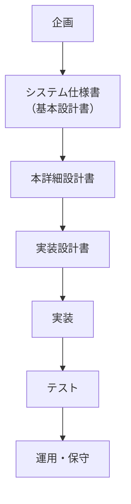

**図1-1　開発工程における本詳細設計書の位置付け**

## 1.3 本詳細設計書の目的

本詳細設計書は、次の事項を目的とする。

- システム仕様書の内容を実装可能な粒度まで具体化すること。

- 実装者間の設計解釈を統一すること。

- テスト仕様書作成の基礎資料とすること。

- 保守及び将来拡張を容易にすること。

## 1.4 システム仕様書との関係

本詳細設計書は、システム仕様書に基づいて作成する。

本詳細設計書では、システム仕様書で定義した仕様を変更せず、実装方法を具体化する。

システム仕様書が改訂された場合は、本詳細設計書についても必要に応じて改訂し、両文書の整合性を維持する。

## 1.5 本詳細設計書の構成

本詳細設計書では、各章を原則として次の構成で記述する。

- システム構成

- クラス設計

- データ設計

- 状態遷移（必要な場合）

- 処理フロー

- 疑似コード

- 保存データ

- エラー処理

- 将来拡張

対象機能の特性に応じて、必要な項目を追加又は省略できる。

## 1.6 実装方針

本詳細設計書では、次の方針に基づいて設計する。

- 責務を明確に分離すること。

- 共通処理を共通化すること。

- モジュール間の依存関係を最小限とすること。

- 将来のゲームモード追加及び機能拡張に対応できる構造とすること。

- 可読性、保守性及び再利用性を重視すること。

## 1.7 図表の記載方法

本詳細設計書では、次の方針に基づいて記載する。

- 図は本文から参照した後に配置する。

- 図番号及び図タイトルは図の下に記載する。

- 表は本文から参照した後に配置する。

- 表番号及び表タイトルは表の上に記載する。

- 図表番号は章ごとに採番する（例：図4-1、表4-1）。

- 図及び表は、本文中で最初に参照した直後に配置することを原則とする。

## 1.8 将来展望

本詳細設計書は、Version 1.0 における実装を対象とする。

Version 1.0 の完成後は、実装及び運用を通じて得られた知見を反映し、システム仕様書との整合性を維持しながら継続的に改訂する。

本詳細設計書もまた、「育てる設計書」として運用する。

# 第2章　システム概要

## 2.1 目的

### 2.1.1 目的

本章では、「招き猫ゲーム」全体のシステム構成及び各システム間の関係を定義する。

各ゲームモード及びイベントの詳細仕様は後続章で定義し、本章ではシステム全体の構造及び責務を明確にする。

### 2.1.2 適用範囲

本章で定義する内容は、すべてのゲームモード及びイベントに共通して適用する。

個別仕様については、各章で定義するものとする。

## 2.2 システム全体構成

### 2.2.1 基本構成

「招き猫ゲーム」は、共通システムを基盤とし、その上で各ゲームモード及びイベントが動作する構成とする。

システム全体構成を図2-1に示す。

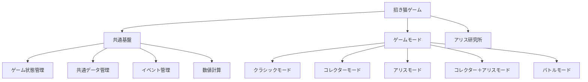

**図2-1　システム全体構成**

> ※ この図は実装上の構成を示すものであり、ゲームモードの概要図とは役割を区別する。

### 2.2.2 システム構成方針

システムは次の方針に基づいて構成する。

- 共通機能は共通基盤へ集約する。

- ゲームモード固有処理は各ゲームモード内で管理する。

- イベントはゲームモードから独立したモジュールとして実装する。

- 新しいゲームモード及びイベントを追加しやすい構造とする。

## 2.3 モジュール構成

### 2.3.1 モジュール一覧

システムは表2-1に示す主要モジュールで構成する。

表2-1　モジュール一覧

| **モジュール** | **主な責務** |
| :-: | :-: |
| ゲーム状態管理 | ゲーム状態の管理 |
| 共通データ管理 | 共通データの保持 |
| ゲームモード | 各ゲームモードの実行 |
| イベント | 各イベントの実行 |
| アリス研究所 | ホームエリア管理 |


※ クラス設計の詳細は各章で定義する。

### 2.3.2 モジュール間の関係

ゲームモードは共通システムを利用して処理を実行する。

イベントはゲームモードから呼び出され、終了後は呼び出し元へ復帰する。

アリス研究所はゲーム本編とは独立したモジュールとして動作する。

## 2.4 システム連携

### 2.4.1 基本処理

ゲーム開始後の基本的な処理順序を図2-2に示す。

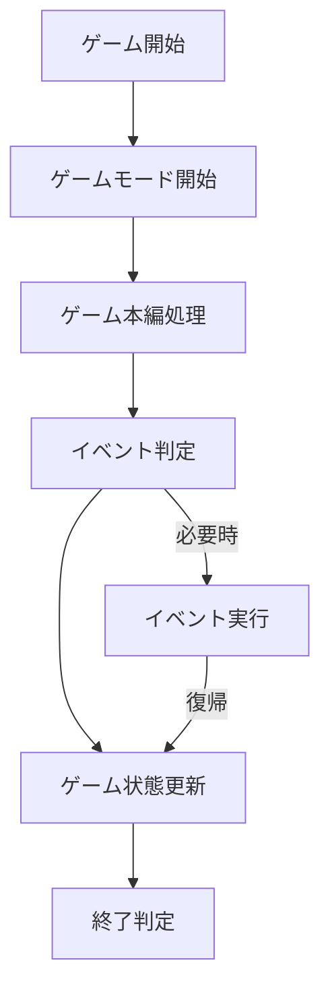

図2-2　システム基本処理フロー

イベントの詳細な処理順序については、第3章及び各イベント章で定義する。

### 2.4.2 共通仕様との関係

各ゲームモード及びイベントは、第3章「共通仕様」に定義する共通ルールに従って動作する。

ゲームモード固有仕様又はイベント固有仕様が共通仕様と異なる場合は、各章でその差異を明示する。

この考え方は、システム仕様書第3章「共通仕様」で定義した「共通仕様を基盤とする構成」を実装へ反映するものである。

## 2.5 データ管理概要

### 2.5.1 データ区分

システム全体で管理するデータは、次の区分とする。

- 共通データ

- 永続データ

- ゲームモード固有データ

- イベント内部データ

各データの詳細な管理方法は、第3章及び各章で定義する。

### 2.5.2 データ管理方針

データ管理では次の事項を基本方針とする。

- データの責務を明確にする。

- 共通データは一元管理する。

- イベント内部状態はイベント終了時に破棄する。

- 永続データはゲーム終了後も保持する。

## 2.6 将来拡張

### 2.6.1 ゲームモード

新しいゲームモードを追加する場合は、共通システムとの互換性を維持した上で独立したモジュールとして追加する。

### 2.6.2 イベント

新しいイベントは既存イベントと同様に独立した章として定義し、ゲームモード本体を変更することなく追加できる構造とする。

### 2.6.3 システム

共通システムの機能追加を行う場合は、既存ゲームモードへの影響を最小限とすることを基本方針とする。

# 第3章　共通仕様

## 3.1 目的

### 3.1.1 目的

本章では、「招き猫ゲーム」に共通するシステム仕様及び実装ルールを定義する。

各ゲームモード及びイベントは、本章で定義する共通仕様を基盤として実装するものとする。

### 3.1.2 適用範囲

本章で定義する内容は、すべてのゲームモード、イベント及び共通基盤に適用する。

各ゲームモード固有の仕様は、それぞれの章で定義する。

## 3.2 共通システム構成

### 3.2.1 共通基盤

ゲーム全体で共通利用する機能を「共通基盤」と定義する。

共通基盤は、ゲームモードに依存しない機能を提供する。

### 3.2.2 共通機能一覧

モジュール一覧を**表3-1**に示す。

**表3-1　共通モジュール一覧**

| モジュール | 主な責務 |
| :-: | :-: |
| ターン管理 | ターン進行の制御 |
| ゲーム状態管理 | ゲーム全体の状態管理 |
| イベント管理 | イベントの開始・終了管理 |
| データ管理 | 共通データの保持 |
| 保存管理 | セーブ・ロード処理 |


## 3.3 ゲーム状態遷移

ゲームは「初期化」「プレイ中」「イベント実行中」「ゲーム終了」の4つの基本状態を持つ。ゲーム状態は図3-1に示す状態遷移にしたがって遷移する。

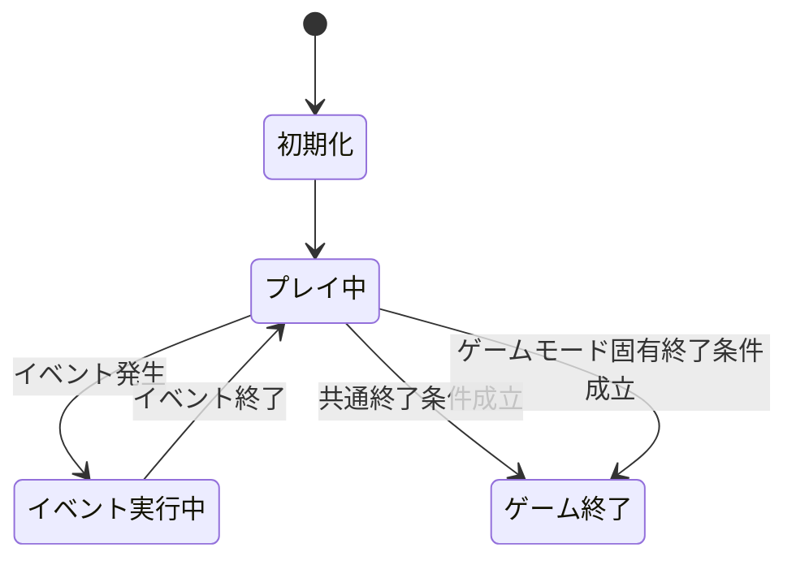

**図3-1　基本状態遷移（概要）**

## 3.4 ターン管理

### 3.4.1 基本方針

すべてのゲームモードは、共通ターン処理にしたがって進行する。

ゲームモード固有処理は、共通ターン処理の中で実行する。

### 3.4.2 ターン進行

共通ターン処理は、原則として以下の順序で実行する。

1. ターン開始
2. 共通更新
3. ゲームモード処理
4. ゲーム終了判定
5. イベント判定
6. 必要に応じてイベント実行
7. ゲーム状態更新
8. ターン終了

ただし、ゲームモード処理によって終了条件が成立した場合は、
イベント判定、イベント実行、ゲーム状態更新及び次ターン開始処理を
実行せず、ゲーム終了処理へ直接移行する。

ゲームモード固有の終了条件及び終了タイミングについては、
各ゲームモードの詳細設計で定義する。

ターン進行を**図3-2**に示す。

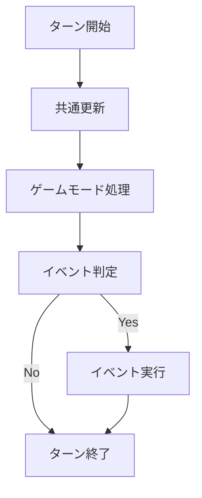

**図3-2　共通ターン処理フロー**

## 3.5 共通データ管理

### 3.5.1 基本方針

共通データはゲーム全体で共有する。

ゲームモード固有データは各ゲームモードで管理する。

### 3.5.2 データ区分

データ区分を**表3-2**に示す。

**表3-2　データ区分**

| **データ区分** | **内容** |
| :-: | :-: |
| 共通データ | 全ゲームモードで共有するデータ |
| モードデータ | 各ゲームモード固有のデータ |
| イベントデータ | イベント実行中のみ利用するデータ |
| 永続データ | セーブ対象データ |

### 3.5.3 ターン内サイコロデータ
ゲームモードでサイコロを使用する場合、
当ターンのサイコロ情報を共通ゲーム状態として管理する。

管理対象は以下のとおりとする。

- diceResults
  当ターンに使用したサイコロの出目一覧

- diceTotal
  当ターンの出目合計

- diceCount
  当ターンに使用したサイコロ数

- currentDiceCount
  次ターンに使用するサイコロ数

これらのデータはGameStateで管理し、
ゲームルールはGameStateを介して参照・更新する。

## 3.6 イベント管理

### 3.6.1 基本方針

イベントはゲームモードから独立した処理単位として実装する。

イベント終了後は、呼び出し元のゲームモードへ制御を戻す。

### 3.6.2 イベント実行順序

イベント実行順序を**図3-3**に示す。

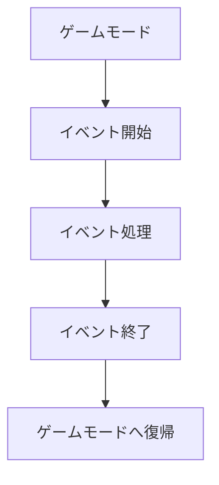

**図3-3　イベント実行フロー**

## 3.7 エラー処理

### 3.7.1 基本方針

共通基盤で発生するエラーは、統一した方法で処理する。

異常終了を可能な限り防止し、ゲームの継続性を優先する。

### 3.7.2 エラー分類

エラー分類を**表3-3**に示す。

**表3-3　共通エラー分類**

| 種別 | 内容 |
| :-: | :-: |
| 入力エラー | 不正入力 |
| データエラー | 保存データ異常 |
| システムエラー | 実行時エラー |

## 3.8 将来拡張

### 3.8.1 基本方針

共通仕様の変更は、既存ゲームモード及び既存イベント への影響を最小限とする。

### 3.8.2 拡張方針

新しいゲームモード又はイベントを追加する場合は、本章で定義した共通仕様との互換性を維持する。

# 第4章　クラシックモード

## 4.1 目的

### 4.1.1 目的

本章では、クラシックモードのシステム構成、処理手順及びデータ管理を定義する。

クラシックモードは、招き猫ゲームの基本となるゲームモードであり、共通仕様にしたがって動作する。

### 4.1.2 適用範囲

本章で定義する内容は、クラシックモードに適用する。

共通仕様については、第3章「共通仕様」にしたがうものとする。

## 4.2 システム構成

### 4.2.1 構成概要

クラシックモードは、共通基盤の上でゲーム進行処理及び招き猫管理処理を実行する。

システム構成を**図4-1**に示す。

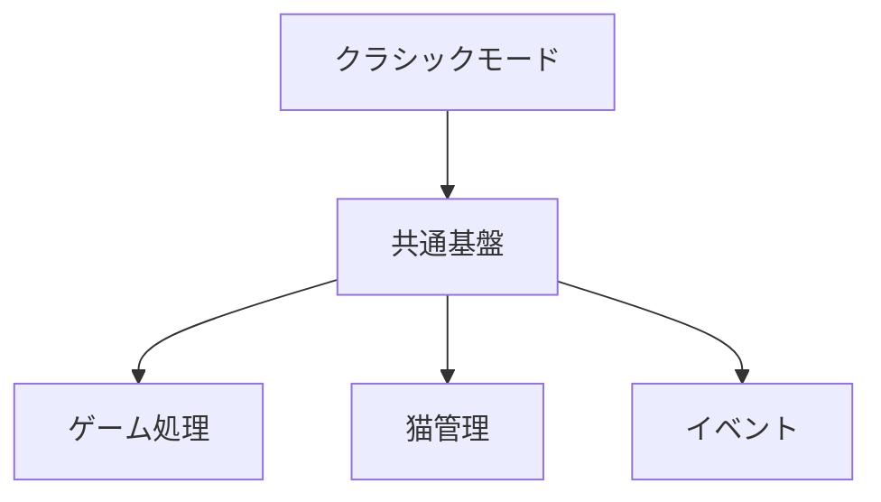

**図4-1　クラシックモード構成**

## 4.3 クラス設計

### 4.3.1 主な責務

**表4-1　クラシックモード主要責務**

| **機能** | **主な責務** |
| :-: | :-: |
| ターン処理 | 1ターンのClassicRule処理 |
| サイコロ処理 | 現在のサイコロ数に応じた出目生成 |
| フェーズ判定 | サイコロ数に応じた処理フェーズ判定 |
| フェーズ1処理 | 出目に応じた招き猫生成 |
| フェーズ2処理 | 出目合計の素数判定 |
| 招き猫数更新 | フェーズ2結果に応じた猫数変更 |
| サイコロ数更新 | 次ターンのサイコロ数決定 |
| 終了判定 | 招き猫数等によるゲーム終了判定 |

## 4.4 処理フロー

ゲーム開始から1ターン終了までの流れを**図4-2**に示す。

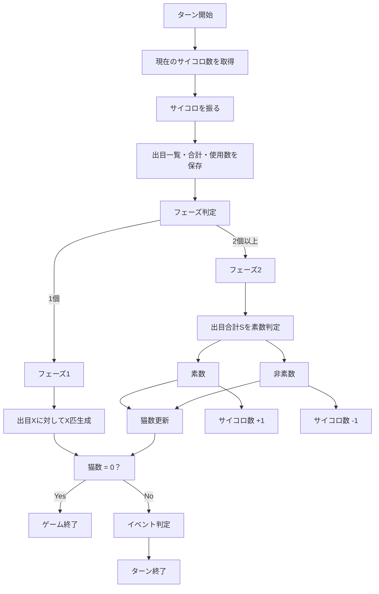

**図4-2　クラシックモード基本処理フロー**

## 4.5 疑似コード

クラシックモードの基本処理を以下に示す。

```
GameStart()

Initialize()

while (ゲーム終了条件を満たさない)

    TurnStart()

    N = GameState.getCurrentDiceCount()

    diceResults = N回サイコロを振る

    diceTotal = diceResultsの合計

    diceCount = N

    GameStateへ出目情報を保存

    if N == 1

        X = diceResults[0]

        X回CatManager.createCat()を実行

        currentDiceCount = 2

    else

        S = diceTotal

        if isPrime(S)

            猫数 = 猫数 - |S - 猫数|

            currentDiceCount = N + 1

        else

            猫数は変更しない

            currentDiceCount = N - 1

        end if

    end if

    if 猫数 == 0

        GameEnd()

    else

        イベント判定

        イベント実行（必要時）

        TurnEnd()

    end if

end while
```

> ※実装時には、第3章で定義した共通ターン処理を利用する。

### 4.5.1 フェーズ判定
現在のサイコロ数を N とする。

N = 1 の場合
    フェーズ1

N >= 2 の場合
    フェーズ2

### 4.5.2 フェーズ1
1. サイコロを1個振る。
2. 出目をXとする。
3. X匹の招き猫を生成する。
4. 次ターンのサイコロ数を2とする。

### 4.5.3 フェーズ2
1. 現在のサイコロ数N個を振る。
2. 全出目の合計をSとする。
3. Sが素数か判定する。
4. 判定結果に応じて猫数を更新する。
5. 次ターンのサイコロ数を更新する。

### 4.5.4 素数の場合
M = 現在の招き猫数

S = 出目合計

    M ← M − |S − M|
ただし、
    M < 0
となる場合は、
    M = 0
とします。

### 4.5.5 招き猫削除処理

フェーズ2の処理によって招き猫数が減少した場合、
削除対象は生成順の古い招き猫から選択する。

同一ターンに複数の招き猫が生成された場合も、
生成順序を維持する。

招き猫の実体管理および削除処理はCatManagerが担当する。

### 4.5.6 次ターンのサイコロ数

フェーズ処理終了後、次ターンに使用するサイコロ数を決定する。

フェーズ1の場合：

    次ターン = 2

フェーズ2かつ素数の場合：

    次ターン = 現在のサイコロ数 + 1

フェーズ2かつ非素数の場合：

    次ターン = 現在のサイコロ数 - 1

ただし、次ターンのサイコロ数は1未満にならない。

### 4.5.7 ゲーム終了判定

フェーズ処理によって招き猫数が0となった場合、
ゲームを即時終了する。

この場合、

- イベント判定
- イベント実行
- ゲーム状態更新
- 次ターン開始

を実行しない。

ゲーム終了処理へ直接移行する。

招き猫数は0未満にはならない。

## 4.6 保存データ

保存対象を**表4-2**に示す。

**表4-2　保存対象データ**

| **データ** | **内容** |
| :-: | :-: |
| ターン数 | 現在ターン |
| 所持猫 | 猫一覧 |
| サイコロ出目一覧 | 当ターンの出目一覧 |
| サイコロ合計 | 当ターンの出目合計 |
| 使用サイコロ数 | 当ターンのサイコロ数 |
| 次ターンのサイコロ数 | 次ターンに使用するサイコロ数 |
| スコア | 現在スコア |

## 4.7 エラー処理

クラシックモードでは、第3章で定義した共通エラー処理を適用する。

クラシックモード固有のエラーが存在する場合のみ、本章で追加定義する。

**表4-3　エラー処理**

| 事象        | 処理               |
| --------- | ---------------- |
| サイコロ生成失敗  | ログ出力後、ターンを安全終了   |
| 招き猫生成失敗   | ログ出力後、可能な範囲で状態維持 |
| 招き猫削除失敗   | ログ出力後、状態整合性を確認   |
| ゲーム状態更新失敗 | ゲーム終了処理へ移行       |

## 4.8 将来拡張

将来追加されるクラシックモード固有機能及びイベント並びに新機能は、本章で定義する構造を維持したまま追加できるものとする。

# 第5章　コレクターモード

## 5.1 目的

### 5.1.1 目的

本章では、コレクターモードのシステム構成、処理手順及びデータ管理を定義する。

コレクターモードは、招き猫の収集を主目的としたゲームモードであり、招き猫の色別収集状況がゲーム進行の中心となる。第3章「共通仕様」に定義する共通基盤の上で動作する。

### 5.1.2 適用範囲

本章で定義する内容は、コレクターモードに適用する。

共通仕様については、第3章「共通仕様」にしたがうものとする。

### 5.1.3 システム仕様書との対応

システム仕様書では、「コレクター＋アリスモード」として定義している。

本詳細設計書では、実装単位を明確にするため、

- コレクターモード

- アリスモード

の2章に分割して記載する。

両モードは共通のゲーム基盤を利用し、システム仕様書における「コレクター＋アリスモード」を構成する。

## 5.2 システム構成

### 5.2.1 構成概要

コレクターモードは、共通基盤に加え、招き猫コレクション管理機能を中心として構成する。

システム構成を**図5-1**に示す。

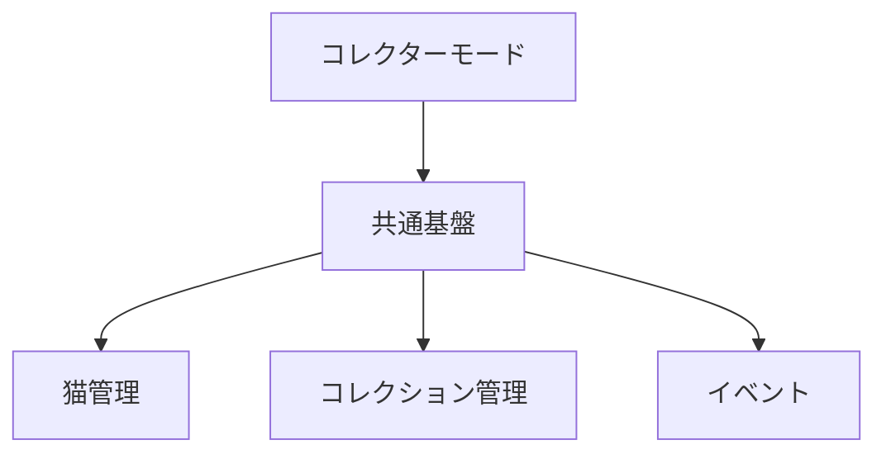

**図5-1　コレクターモード構成**

**色決定**
生成する招き猫の色は、表5-1に示すとおりとする。

**表5-1　色決定**

|  出目 | 色  |
| --: | -- |
| 1・4 | 白猫 |
| 2・5 | 黒猫 |
| 3・6 | 金猫 |

**生成数**
生成する招き猫の数は、表5-2のとおりサイコロの出目と同じ数とする。

**表5-2　生成数**

| 出目 | 結果   |
| -: | ---- |
|  1 | 白猫1匹 |
|  2 | 黒猫2匹 |
|  3 | 金猫3匹 |
|  4 | 白猫4匹 |
|  5 | 黒猫5匹 |
|  6 | 金猫6匹 |

## 5.3 クラス設計

### 5.3.1 主な責務

**表5-3　コレクターモード主要責務**

| **機能** | **主な責務** |
| :-: | :-: |
| ゲーム進行 | ターン進行・終了判定 |
| 猫管理 | 招き猫の生成・更新・削除 |
| コレクション管理 | 入手済み招き猫の管理 |
| イベント管理 | イベント開始・終了 |
| 保存管理 | セーブ・ロード |

## 5.4 処理フロー

コレクターモードの基本処理を**図5-2**に示す。

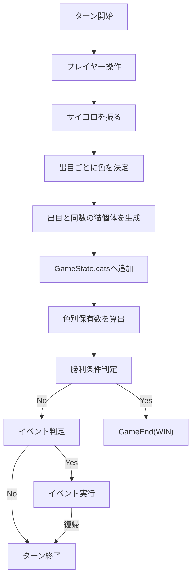

**図5-2　コレクターモード基本処理フロー**

## 5.5 疑似コード

```
TurnStart()

diceResults = RollDice()

for each diceResult in diceResults

    color = DetermineCatColor(diceResult)

    count = diceResult

    for i = 1 to count

        cat = CreateCat(
            color = color
        )

        CatManager.addCat(cat)

    end for

end for

if CheckVictoryCondition()

    GameEnd(WIN)

else

    CheckEvent()

    if event exists

        ExecuteEvent()

    end if

    TurnEnd()

end if
```

```
CheckVictoryCondition()

    whiteCount = GameState.cats の白猫個体数
    blackCount = GameState.cats の黒猫個体数
    goldCount  = GameState.cats の金猫個体数

    if whiteCount >= 10
       and blackCount >= 10
       and goldCount >= 10

        return WIN

    else

        return CONTINUE

    end if
```

> ※共通ターン処理は、第3章「共通仕様」にしたがう。

## 5.6 保存データ

保存対象を**表5-4**に示す。

**表5-4　保存対象データ**

| データ | 内容 |
| :-: | :-: |
| ターン数 | 現在ターン |
| 所持猫 | 招き猫一覧 |
| コレクション | 取得済み招き猫 |
| スコア | 現在スコア |

## 5.7 エラー処理

コレクターモードでは、第3章で定義した共通エラー処理を適用する。

コレクションデータの整合性に関する固有エラーがある場合のみ、本章で追加定義する。

## 5.8 将来拡張

将来追加される新しい招き猫、収集条件及びコレクション機能は、本章で定義した構造を維持したまま追加できるものとする。

# 第6章　アリスモード

## 6.1 目的

### 6.1.1 目的

本章では、アリスモードのシステム構成、処理手順及びデータ管理を定義する。

アリスモードは、招き猫に寿命（lifetime）を付与し、ターン経過に伴う寿命管理を特徴とする特殊ゲームモードであり、第3章「共通仕様」に定義する共通基盤の上で動作する。

### 6.1.2 適用範囲

本章で定義する内容は、アリスモードに適用する。

共通仕様については、第3章「共通仕様」にしたがうものとする。

## 6.2 システム構成

### 6.2.1 構成概要

アリスモードは、共通基盤に加え、招き猫寿命管理機能を備える。

システム構成を**図6-1**に示す。

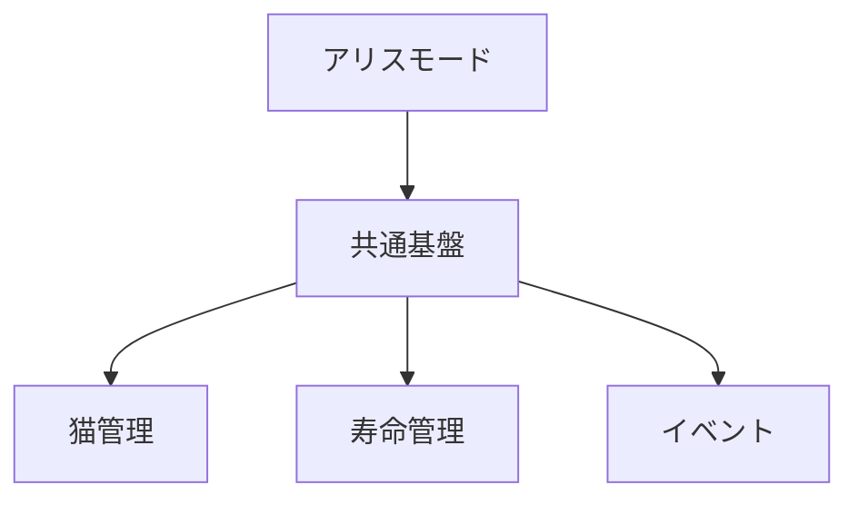

**図6-1　アリスモード構成**

## 6.3 クラス設計

### 6.3.1 主な責務

**表6-1　アリスモード主要責務**

| **機能** | **主な責務** |
| :-: | :-: |
| ゲーム進行 | ターン進行・終了判定 |
| 猫管理 | 招き猫の生成・更新・削除 |
| 寿命管理 | 招き猫の寿命更新・削除判定 |
| イベント管理 | イベント開始・終了 |
| 保存管理 | セーブ・ロード |

## 6.4 処理フロー

アリスモードの基本処理を**図6-2**に示す。

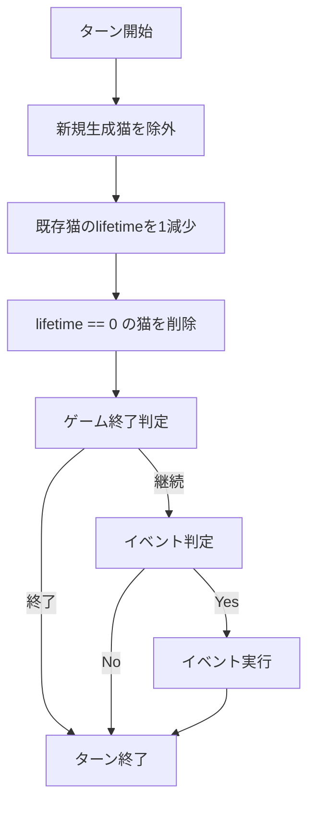

**図6-2　アリスモード基本処理フロー**

## 6.5 疑似コード

```
TurnStart()

for each cat

    if cat.createdAt != currentTurn

        cat.lifetime--

    end if

end for

lifetime == 0 の猫を削除

if 猫数 == 0

    GameEnd()

else

    CheckEvent()

    TurnEnd()

end if
```

> ※寿命更新処理は、第3章で定義した共通ターン処理の一部として実行する。

## 6.6 保存データ

保存対象を**表6-2**に示す。

**表6-2　保存対象データ**

| **データ** | **内容** |
| :-: | :-: |
| ターン数 | 現在ターン |
| 所持猫 | 招き猫一覧 |
| 各招き猫の寿命 | lifetime |
| アリスモード固有状態 | モード管理情報 |
| id        | 個体識別ID |
| color     | 招き猫の色  |
| lifetime  | 残り寿命   |
| createdAt | 生成ターン  |


## 6.7 エラー処理

アリスモードでは、第3章で定義した共通エラー処理を適用する。

寿命データの不整合や削除対象データの異常を検出した場合は、ゲーム継続を優先し、安全な状態へ復旧する。

## 6.8 将来拡張

アリスモード固有の特殊行動、追加パラメータ及び新しい寿命制御機能は、本章で定義した構造を維持したまま追加できるものとする。

将来、寿命以外の経年変化要素を追加する場合も、本章の寿命管理機構を拡張して対応する。

# 第7章　バトルモード

## 7.1 目的

### 7.1.1 目的

本章では、バトルモードのシステム構成、処理手順及びデータ管理を定義する。

バトルモードは、プレイヤーと対戦相手との勝敗判定を中心としたゲームモードであり、第3章「共通仕様」に定義する共通基盤の上で動作する。

### 7.1.2 適用範囲

本章で定義する内容は、バトルモードに適用する。

共通仕様については、第3章「共通仕様」にしたがうものとする。

## 7.2 システム構成

### 7.2.1 構成概要

バトルモードは、共通基盤に加え、対戦処理及び勝敗判定機能を中心として構成する。

システム構成を**図7-1**に示す。

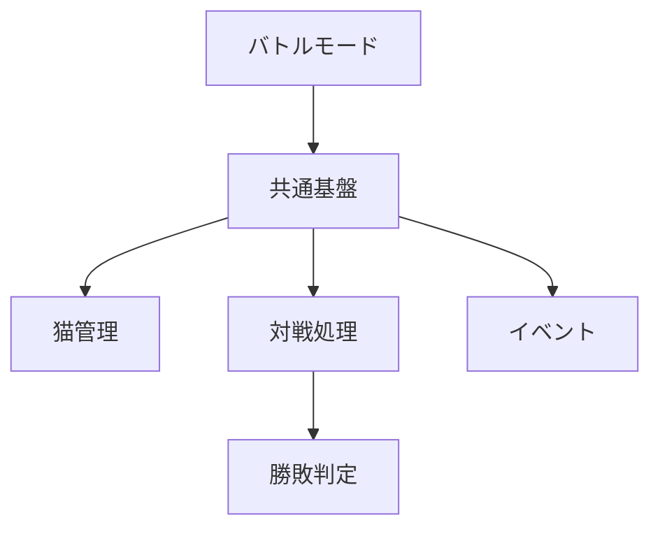

**図7-1　バトルモード構成**

## 7.3 クラス設計

### 7.3.1 主な責務

**主な責務を表7-1に示す。**

**表7-1　バトルモード主要責務**

| **機能** | **主な責務** |
| :-: | :-: |
| ゲーム進行 | ターン進行・終了判定 |
| 猫管理 | 招き猫の生成・更新・削除 |
| 対戦処理 | バトル進行の管理 |
| 勝敗判定 | 勝敗条件の判定 |
| イベント管理 | イベント開始・終了 |
| 保存管理 | セーブ・ロード |

## 7.4 処理フロー

### 7.4.1 ターン処理

バトルモードにおける1ターンの処理手順を**図7-2**に示す。

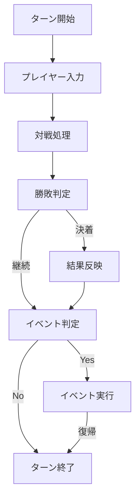

**図7-2　バトルモード処理フロー**

## 7.5 疑似コード

```
GameStart()                    
                    
                    
Initialize()                    
                    
                    
while (終了条件を満たさない)                    
                    
                    
    TurnStart()                    
                    
                    
    PlayerAction()                    
                    
                    
    ExecuteBattle()                    
                    
                    
    JudgeBattleResult()                    
                    
                    
    CheckEvent()                    
                    
                    
    TurnEnd()                    
                    
                    
GameEnd()
```

> ※共通ターン処理は、第3章「共通仕様」にしたがう。

## 7.6 保存データ

保存対象を**表7-2**に示す。

**表7-2　保存対象データ**

| **データ** | **内容** |
| :-: | :-: |
| ターン数 | 現在ターン |
| 所持猫 | 招き猫一覧 |
| バトル状態 | 対戦情報 |
| 勝敗記録 | 勝敗結果 |
| スコア | 現在スコア |


## 7.7 エラー処理

バトルモードでは、第3章で定義した共通エラー処理を適用する。

勝敗判定に必要なデータが不足している場合は、ゲーム継続を優先し、安全な状態へ復旧する。

## 7.8 将来拡張

将来追加される対戦ルール、勝敗条件及び特殊イベントは、本章で定義した構造を維持したまま追加できるものとする。

## 7.9 NPCアルゴリズム

### 7.9.1 目的

本節では、バトルモードにおけるNPCの意思決定アルゴリズムを定義する。

NPCは難易度ごとに判断基準を変更し、異なるゲーム体験を提供する。

なお、NPCはプレイヤーと同一のゲームルールに従って行動し、未公開情報を参照してはならない。

### 7.9.2 共通仕様

すべてのNPCは、各ターン終了時に次の順序で行動を決定する。

1. 現在のゲーム状態を取得する。

2. 勝敗に影響する情報を評価する。

3. 難易度に応じた判定を行う。

4. 次の行動を決定する。

5. 行動を実行する。

NPCの行動決定処理を図7-3に示す。

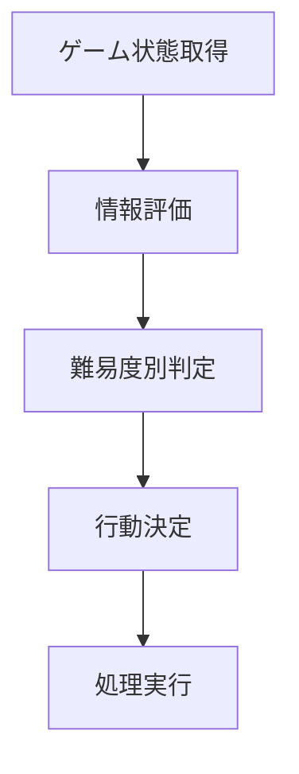

**図7-3　NPC行動決定フロー**

### 7.9.3 Easy

Easyは初心者向けのNPCとする。

**判断基準**

評価対象は次の情報とする。

- 現在の招き猫数

- ドロップアウト可能かどうか

期待値計算及び将来予測は行わない。

**行動方針**

- 一定数以上の招き猫を獲得した場合は、早めにドロップアウトを選択する。

- 危険な状況では、安全な行動を優先する。

### 7.9.4 Normal

Normalは標準難易度とする。

**判断基準**

評価対象は次の情報とする。

- 現在の招き猫数

- 続行した場合の期待値

- ドロップアウト時の期待値

**行動方針**

期待値を比較し、

- 続行期待値が高い場合は続行

- 期待値が同程度の場合は、安全側の行動を優先する。

- ドロップアウト期待値が高い場合は撤退

を選択する。

### 7.9.5 Hard

Hardは上級者向けのNPCとする。

**判断基準**

評価対象は次の情報とする。

- 現在の招き猫数

- 続行期待値

- ドロップアウト期待値

- 勝負師アリス利用時の期待値

- 現在の順位

- 他プレイヤーとの得点差

**行動方針**

取得可能な情報から期待値を算出し、最も期待値が高い行動を選択する。

未公開情報及び将来発生する乱数は利用しない。

### 7.9.6 判断優先順位

判断優先順位を表7-3に示す。

**表7-3　NPC判断基準**

| **項目** | **Easy** | **Normal** | **Hard** |
| :-: | :-: | :-: | :-: |
| 現在の招き猫数 | ○ | ○ | ○ |
| ドロップアウト可否 | ○ | ○ | ○ |
| 続行期待値 | ― | ○ | ○ |
| ドロップアウト期待値 | ― | ○ | ○ |
| 勝負師アリス期待値 | ― | ― | ○ |
| 他プレイヤー（対戦相手）の状況 | ― | △ | ○ |


※「△」は参考情報として利用することを示す。

### 7.9.7 疑似コード

```
ReadGameState()              
              
              
switch (Difficulty)              
              
              
    Easy              
              
        ExecuteEasyAI()              
              
              
    Normal              
              
        ExecuteNormalAI()              
              
              
    Hard              
              
        ExecuteHardAI()              
              
              
ExecuteAction()
```

### 7.9.8 将来拡張

将来的に、新たな難易度又はNPC固有AIを追加する場合は、本節の共通仕様を維持したまま判断アルゴリズムを追加する。

難易度追加時は、既存難易度の挙動へ影響を与えない構造とする。

# 第8章　もぐもぐチャレンジ

## 8.1 概要

### 8.1.1 目的

本章では、もぐもぐチャレンジの詳細設計を定義する。

もぐもぐチャレンジは、第3章「共通仕様」に定義するイベント共通仕様にしたがって動作するイベントであり、ゲームモードから一時的に呼び出される独立した処理として実装する。

### 8.1.2 適用範囲

本章は、もぐもぐチャレンジに関する以下の事項を対象とする。

- チャレンジ進行

- もぐもぐ判定

- 成功・失敗処理

- データ管理

- 例外処理

ゲーム状態管理、イベントライフサイクル及び共通データ管理については、第3章にしたがう。

### 8.1.3 他章との関係

もぐもぐチャレンジは、

- クラシックモード

- コレクターモード

- アリスモード

- バトルモード

- 勝負師アリス

から呼び出される。

イベント終了後は、開始元のゲームモードへ復帰する。

## 8.2 チャレンジ進行

### 8.2.1 処理概要

チャレンジ進行処理を図8-1に示す。

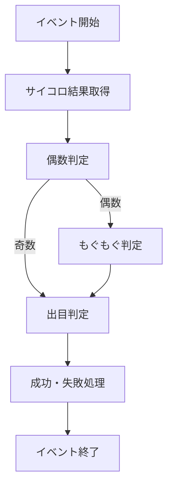

**図8-1　チャレンジ進行処理**

### 8.2.2 処理手順

チャレンジは次の順序で実行する。

1. サイコロ結果取得

2. 偶数判定

3. もぐもぐ判定（偶数時）

4. 出目判定

5. 成功・失敗処理

6. イベント終了

※処理順序は変更しないこと。

### 8.2.3 疑似コード

```
StartChallenge()                  
                  
                  
dice = RollDice()                  
                  
                  
if IsEven(dice)                  
                  
                  
    if CheckMogumogu()                  
                  
                  
        ExecuteFailure()                  
                  
                  
    else                  
                  
                  
        JudgeDice()                  
                  
                  
else                  
                  
                  
    JudgeDice()                  
                  
                  
ApplyResult()                  
                  
                  
EndChallenge()
```

## 8.3 もぐもぐ判定

この節は、システム仕様書第5章「もぐもぐ判定アルゴリズム」を実装レベルへ展開した節である。

### 8.3.1 判定入力

判定に使用する入力値を表8-1に示す。

**表8-1　判定入力**

| **項目** | **内容** |
| :-: | :-: |
| 基本確率 | システム設定値 |
| 空腹度 | アリス状態 |
| 機嫌 | アリス状態 |
| 成功回数 | イベント内部状態 |

### 8.3.2 判定処理

判定処理を図8-2に示す。

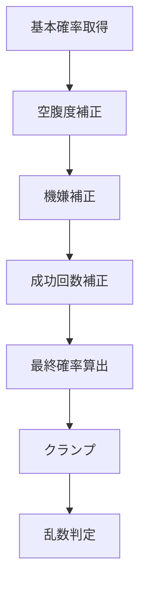

**図8-2　もぐもぐ判定処理**

### 8.3.3 処理順序

処理順序は固定とする。

1. 基本確率

2. 空腹度補正

3. 機嫌補正

4. 成功回数補正

5. クランプ

6. 乱数判定

各補正値はシステム仕様書で定義した計算規則を適用する。

## 8.4 成功・失敗処理

### 8.4.1 成功処理

成功時は、

- 成功報酬を適用する。

- 必要なゲーム状態を更新する。

- イベントを終了する。

### 8.4.2 失敗処理

失敗時は、

- イベント失敗処理を実行する。

- 必要なゲーム状態を更新する。

- イベントを終了する。

### 8.4.3 処理フロー

成功・失敗処理を図8-3に示す。

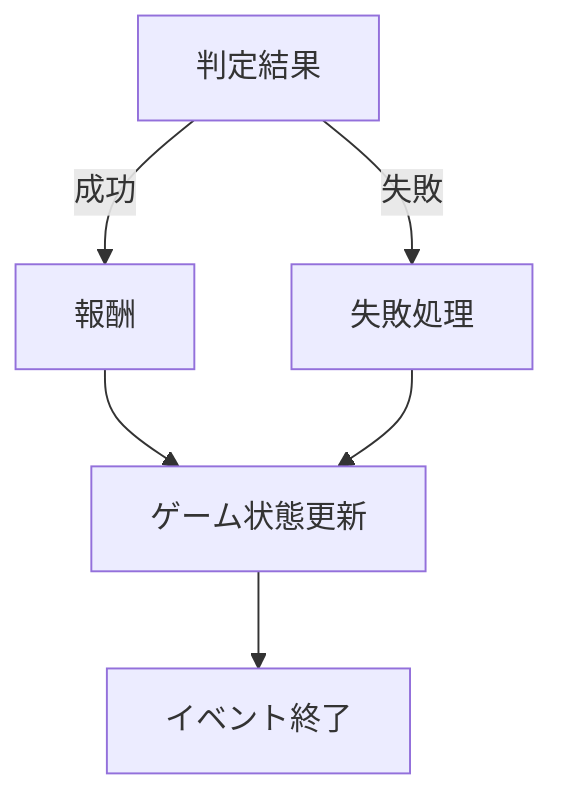

**図8-3　成功・失敗処理**

## 8.5 データ管理

### 8.5.1 管理データ

管理対象を表8-2に示す。

**表8-2　管理データ**

| **データ** | **種別** |
| :-: | :-: |
| 成功回数 | イベント内部状態 |
| 空腹度 | 永続状態 |
| 機嫌 | 永続状態 |

### 8.5.2 データ更新

各データの更新は、第3章「共通データ管理」に従う。

イベント内部状態はイベント終了時に破棄し、永続状態は保持する。

## 8.6 例外・境界条件

### 8.6.1 基本方針

例外発生時は、ゲーム状態の整合性を維持したままイベントを終了する。

## 8.6.2 対応事項

例外として以下を考慮する。

- ゲーム終了との競合

- イベント中断

- セーブ・ロード

- 不正状態

各処理はシステム仕様書で定義した方針にしたがう。

## 8.7 将来拡張

新しい補正項目を追加する場合は、

- 判定入力

- 判定処理

- 管理データ

を追加することで対応できる構造とする。

既存処理の順序は変更しないことを原則とする。

# 第9章　チェシャ猫イベント

## 9.1 概要

### 9.1.1 目的

本章では、チェシャ猫イベントの詳細設計を定義する。

チェシャ猫イベントは、第3章「共通仕様」に定義するイベント共通仕様にしたがって動作する特殊イベントであり、ゲームモード実行中に低確率で発生する独立したイベントとして実装する。

### 9.1.2 適用範囲

本章は、チェシャ猫イベントに関する以下の事項を対象とする。

- 発生条件

- 効果選択

- 効果実行

- 発生制限

- データ管理

世界観及びイベントライフサイクルについては、第2章及び第3章にしたがう。

### 9.1.3 他章との関係

チェシャ猫イベントは、

- クラシックモード

- コレクターモード

- アリスモード

- バトルモード

から呼び出される。

イベント終了後は、開始元のゲームモードへ復帰する。

## 9.2 発生条件

### 9.2.1 処理概要

発生判定処理を図9-1に示す。

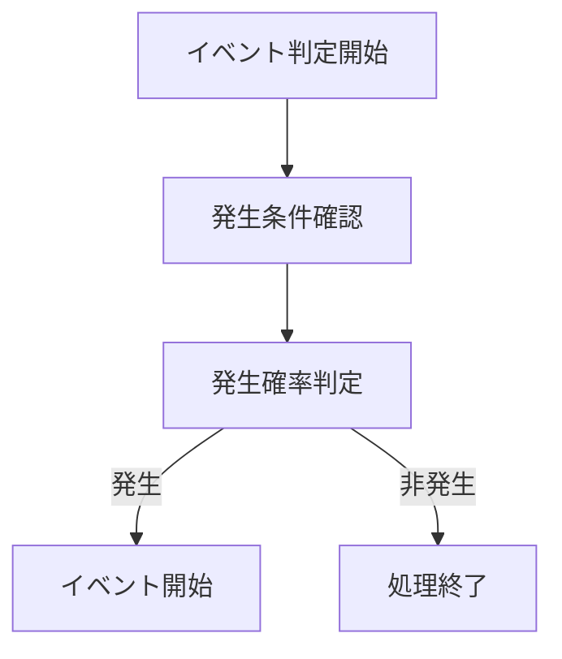

**図9-1　チェシャ猫イベント発生判定**

### 9.2.2 処理手順

発生判定は次の順序で実行する。

1. 発生タイミング確認

2. 発生制限確認

3. 発生確率取得

4. 乱数判定

5. イベント開始

処理順序は変更しないものとする。

### 9.2.3 疑似コード

```
if (CheckEventTiming())            
            
            
    if (CheckRestriction())            
            
            
        if (CheckProbability())            
            
            
            StartCheshireEvent()
```

## 9.3 効果選択アルゴリズム

本節は、システム仕様書第6.3節「効果選択アルゴリズム」を実装レベルへ展開したものである。

### 9.3.1 効果選択処理

効果選択処理を図9-2に示す。

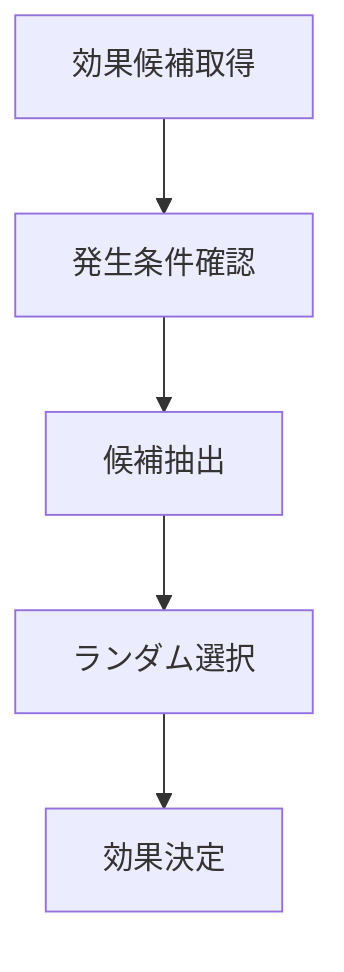

**図9-2　効果選択処理**

### 9.3.2 処理順序

1. 効果候補取得

2. 実行可能判定

3. 候補一覧生成

4. ランダム選択

5. 効果決定

### 9.3.3 「笑顔だけ残して消える」の扱い

「笑顔だけ残して消える」は、ゲーム状態を変更しない特殊効果として扱う。

ゲーム状態は変更せず、演出のみ実行する。

## 9.4 各効果仕様

### 9.4.1 基本方針

各効果は独立した処理として実装する。

各効果終了後は共通終了処理へ遷移する。

### 9.4.2 効果共通フロー

各効果の共通処理を図9-3に示す。

```mermaid
%% 図9-3 効果共通処理  
  
flowchart TD  
  
    A["効果開始"]
    B["対象取得"]
    C["効果適用"]
    D["ゲーム状態更新"]
    E["効果終了"]

    A --> B
    B --> C
    C --> D
    D --> E
```

**図9-3　効果共通処理**

### 9.4.3 効果実装方針

仕様書で定義する各効果

- 招き猫増減

- サイコロ変動

- アリス変動

- その他効果

は、それぞれ独立した処理単位として実装する。

## 9.5 発生制限

### 9.5.1 基本方針

チェシャ猫イベントは、1ターンにつき最大1回まで発生する。

### 9.5.2 制御方法

イベント終了後は、

- 当ターンの発生フラグ

を設定し、同一ターン中は再判定を行わない。

### 9.5.3 他イベントとの関係

イベント優先順位及び同時発生制御は、システム仕様書第3.4節 「イベント共通仕様」にしたがう。

## 9.6 データ管理

### 9.6.1 管理データ

管理対象を表9-1に示す。

**表9-1　管理データ**

| **データ** | **内容** |
| :-: | :-: |
| 発生フラグ | 同一ターン再発防止 |
| 効果ID | 実行効果 |
| イベント状態 | イベント内部状態 |


### 9.6.2 更新タイミング

- イベント開始

- 効果決定

- 効果終了

の各時点で更新する。

## 9.7 例外処理

イベント実行中に例外が発生した場合は、

1. イベントを中断する。

2. ゲーム状態の整合性を確認する。

3. 開始元ゲームモードへ復帰する。

## 9.8 将来拡張

新しいチェシャ猫効果を追加する場合は、

- 効果候補一覧

- 効果選択アルゴリズム

- 効果処理

へ追加することで対応できる構造とする。

既存効果への影響を最小限に抑えるものとする。

# 第10章　アリス研究所

## 10.1 概要

### 10.1.1 目的

本章では、アリス研究所の詳細設計を定義する。

アリス研究所は、招き猫ゲーム全体のホームエリア（拠点）として機能し、ゲームモードの選択、資料閲覧及び各種コンテンツへのアクセスを提供する。

### 10.1.2 適用範囲

本章は、アリス研究所に関する以下の事項を対象とする。

- 全体構成

- 研究者モード

- 研究室

- 3人の部屋

- 図書室

- 音楽室・ギャラリー

- 中庭

- Memory

- データ管理

### 10.1.3 他章との関係

アリス研究所はゲームモードとは独立したホームエリアである。

ゲームモードへの遷移及び共通データ管理は、システム仕様書第2章及び第3章の定義にしたがう。

## 10.2 全体構成

### 10.2.1 構成概要

アリス研究所は、各施設を独立した機能単位として構成する。

全体構成を図10-1に示す。

```mermaid
%% 図10-1 アリス研究所全体構成  
  
flowchart TD  
  
    A["アリス研究所"]
    B["ホームエリア"]

    C["研究室"]
    D["図書室"]
    E["音楽室"]
    F["ギャラリー"]
    G["中庭"]
    H["3人の部屋"]

    I["Memory"]

    A --> B

    B --> C
    B --> D
    B --> E
    B --> F
    B --> G
    B --> H

    F --> I
```

**図10-1　アリス研究所全体構成**

## 10.3 研究者モード

### 10.3.1 目的

研究者モードは、ゲームをプレイする立場ではなく、作品全体を研究データとして閲覧したりゲーム解析をしたりするためのモードとする。

### 10.3.2 処理フロー

研究者モードの基本処理を図10-2に示す。

```mermaid
%% 図10-2 研究者モード処理フロー  
  
flowchart TD  
  
    A["研究所表示"]
    B["研究者モード選択"]
    C["機能選択"]
    D["対象施設表示"]
    E["研究所へ戻る"]

    A --> B
    B --> C
    C --> D
    D --> E
```

**図10-2　研究者モード処理フロー**


## 10.4 研究室

### 10.4.1 役割

研究室では、

- ゲーム資料

- 設計資料

- 将来構想

などを閲覧できるものとし、研究者モードへの入口となっている。

### 10.4.2 管理データ

管理対象を表10-1に示す。

**表10-1　研究室管理データ**

| **データ** | **内容** |
| :-: | :-: |
| 資料ID | 資料識別子 |
| 公開状態 | 閲覧可否 |
| 更新日時 | 最終更新日時 |


## 10.5 3人の部屋

### 10.5.1 役割

3人の部屋は、作品世界に登場する3人に関するコンテンツを表示する施設とする。

### 10.5.2 処理概要

表示対象を選択し、対応するコンテンツを表示する。

## 10.6 図書室

### 10.6.1 役割

図書室では、

- 数学

- 情報科学

- 確率論

- その他参考資料

などを分類して表示する。

### 10.6.2 処理方針

資料はカテゴリごとに管理し、カテゴリ選択後に一覧表示する。

## 10.7 音楽室・ギャラリー

### 10.7.1 役割

音楽室及びギャラリーでは、作品に関連する音楽及びイラストを表示する。

### 10.7.2 共通処理

処理は次の順序で実行する。

1. 一覧表示

2. 項目選択

3. コンテンツ表示

4. 一覧へ戻る

## 10.8 中庭

### 10.8.1 役割

中庭は、研究所以外の各施設とは異なる自由閲覧エリアとして扱う。

### 10.8.2 将来利用

イベント及び季節演出などの追加に対応できる構造とする。

## 10.9 Memory

### 10.9.1 役割

Memoryは、ゲーム内で取得した実績や閲覧履歴などを表示する機能とする。

### 10.9.2 管理データ

管理対象を表10-2に示す。

**表10-2　Memory管理データ**

| **データ** | **内容** |
| :-: | :-: |
| 実績 | 解放済み情報 |
| 閲覧履歴 | 表示済み資料 |
| アルバム | 収集済み情報 |


## 10.10 将来拡張

新しい施設を追加する場合は、

- ホームエリア

- メニュー

- データ管理

へ追加することで対応できる構造とする。

既存施設への影響を最小限に抑えるものとする。

# 付録A　用語集

### アリス

本作の主人公。ゲーム内ではアリスモードおよびチャレンジイベント等で使用される。

### アリス研究所

研究者モードで利用する施設群の総称。

### イベント

ゲーム中に条件を満たすことで発生する特殊処理。

### クラシックモード

基本となるゲームモード。

### コレクターモード

招き猫の収集を目的としたゲームモード。

### アリスモード

招き猫に寿命が設定されるゲームモード。

### バトルモード

NPCとの対戦を行うゲームモード。

### チェシャ猫イベント

ランダムに発生する特殊イベント。

### もぐもぐ判定

偶数出目時に実施される判定処理。

### Lifetime

招き猫の寿命を表す値。

### NPC

コンピュータが制御する対戦相手。

### Memory

アリス研究所ギャラリー内で閲覧可能な記録機能。

### ホームエリア

アリス研究所の中心画面。

### 共通基盤

全ゲームモードで利用する共通処理群。

### ゲーム状態

ゲーム全体で共有される内部データ。

### ターン

ゲーム内で処理を進める最小単位。

# 付録B　図表一覧

## 図一覧

| **図番号** | **図名** |
| :-: | :-: |
| 図1-1 | 開発工程における本詳細設計書の位置付け |
| 図2-1 | システム全体構成 |
| 図2-2 | システム基本処理フロー |
| 図3-1 | 基本状態遷移（概要） |
| 図3-2 | 共通ターン処理フロー |
| 図3-3 | イベント実行フロー |
| 図4-1 | クラシックモード構成 |
| 図4-2 | クラシックモード基本処理フロー |
| 図5-1 | コレクターモード構成 |
| 図5-2 | コレクターモード基本処理フロー |
| 図6-1 | アリスモード構成 |
| 図6-2 | アリスモード基本処理フロー |
| 図7-1 | バトルモード構成 |
| 図7-2 | バトルモード処理フロー |
| 図7-3 | NPC行動決定フロー |
| 図8-1 | チャレンジ進行処理 |
| 図8-2 | もぐもぐ判定処理 |
| 図8-3 | 成功・失敗処理 |
| 図9-1 | チェシャ猫イベント発生判定 |
| 図9-2 | 効果選択処理 |
| 図9-3 | 効果共通処理 |
| 図10-1 | アリス研究所全体構成 |
| 図10-2 | 研究者モード処理フロー |


## 表一覧

| **番号** | **名称** |
| :-: | :-: |
| 表2-1 | モジュール一覧 |
| 表3-1 | 共通モジュール一覧 |
| 表3-2 | データ区分 |
| 表3-3 | 共通エラー分類 |
| 表4-1 | クラシックモード主要責務 |
| 表4-2 | 保存対象データ |
| 表5-1 | コレクターモード主要責務 |
| 表5-2 | 保存対象データ |
| 表6-1 | アリスモード主要責務 |
| 表6-2 | 保存対象データ |
| 表7-1 | バトルモード主要責務 |
| 表7-2 | 保存対象データ |
| 表7-3 | NPC判断基準 |
| 表8-1 | 判定入力 |
| 表8-2 | 管理データ |
| 表9-1 | 管理データ |
| 表10-1 | 研究室管理データ |
| 表10-2 | Memory管理データ |


