# 招き猫ゲーム

# 実装設計書　Version 1.6

# (Implementation Specification)

### 作成日：

### 2026年8月16日

### 作成者：

### アリス研究所　shigmah

### 技術協力

### OpenAI　ChatGPT

## 改訂履歴

| 版数 | 日付 | 内容 |
| :-: | :-: | :-: |
| 1.0 | 2026-08-06 | 初版作成（正式版） |
| 1.1 | 2026-08-07 | ドロップアウト追記（詳細設計書との不整合修正） |
| 1.2 | 2026-08-08 | RandomManagerの公開メソッド引数、エラー処理およびシード管理仕様を明確化 |
| 1.3 | 2026-08-08 | Catデータモデルの詳細仕様を追加 |
| 1.4 | 2026-08-09 | サイコロ関係処理追加 |
| 1.5 | 2026-08-10 | クラシックモード基本ルールの詳細化、サイコロ処理・フェーズ処理・ゲーム終了条件を追加 |
| 1.6 | 2026-08-16 | アリスモードに目標ターン数をプレイヤーが設定可能（デフォルト20）を追加 |

Version 1.3では、既存のCatManagerおよびデータモデル一覧で定義されていた
Catについて、保持データ、責務、生成、状態更新、利用関係およびエラー処理を明文化した。


# 第1章　はじめに

## 1.1 目的

本書は、「招き猫ゲーム」の実装方法を定義することを目的とする。

システム仕様書および詳細設計書で定義した設計内容を基に、クラス構成、ディレクトリ構成、命名規則、実装単位、データ構造および処理手順を具体化し、実装担当者が統一した品質でソフトウェアを実装できるようにする。

また、本書は実装時の判断基準として利用するとともに、保守・機能追加・Versionアップ時の基礎資料としても利用する。

## 1.2 対象読者

本書は、以下の読者を対象とする。

- プログラム実装担当者

- 保守・改修担当者

- 将来のVersionアップを担当する開発者

- システム構造を理解したい開発者

## 1.3 本書の位置付け

本書は、システム開発工程において詳細設計書と実装の間に位置する文書である。

本書では、

- クラス設計

- ディレクトリ構成

- メソッド設計

- データ構造

- 命名規則

- 実装ルール

を定義する。

なお、実装アルゴリズムおよびゲーム仕様については詳細設計書を正本とする。

## 1.4 関連文書

本書は、表1-1に示す文書を参照して作成する。

**表1-1　関連文書一覧**

| **文書名** | **内容** |
| :-: | :-: |
| システム仕様書 Version 1.0 | ゲーム全体仕様・基本設計 |
| 詳細設計書 Version 1.0 | ゲーム処理・システム詳細設計 |
| GitHub運用ルール Version 1.0 | バージョン管理・開発運用 |
| 設定資料集 Version 1.0（作成中） | 世界観・キャラクター・研究資料 |

## 1.5 実装方針

本プロジェクトでは、以下の方針に基づいて実装を行う。

- クラス単位で責務を明確に分離する。

- 共通処理は共通基盤へ集約する。

- ゲームモードごとの独立性を維持する。

- 拡張性を考慮し、新規ゲームモードやイベントを容易に追加できる構成とする。

- 詳細設計書との整合性を維持し、仕様変更時は設計書を優先して更新する。

## 1.6 コーディング方針

実装時は以下の方針を採用する。

- 可読性を優先する。

- 1クラス1責務を原則とする。

- マジックナンバーは使用しない。

- 定数化可能な値は定数として定義する。

- コメントは「何をしているか」ではなく、「なぜそうするか」を記述する。

- 実装内容は詳細設計書と一致させる。

## 1.7 本書の構成

本書は表1-2に示す章で構成する。

**表1-2　本書の構成**

| **章** | **内容** |
| :-: | :-: |
| 第1章 | はじめに |
| 第2章 | プロジェクト構成 |
| 第3章 | 共通基盤実装 |
| 第4章 | PlayRule実装 |
| 第5章 | データモデル・AI設計 |
| 第6章 | 例外処理・ログ設計 |
| 第7章 | プロジェクト構成設計 |
| 第8章 | 実装ガイドライン |
| 付録 | クラス一覧・命名規則・用語集等 |

**【設計者メモ】**

本書はソースコードそのものを記述する文書ではなく、「実装方針を共有するための設計書」である。

実装時に仕様変更が必要となった場合は、ソースコードを先に変更するのではなく、システム仕様書・詳細設計書・実装設計書の順に更新し、設計と実装の整合性を維持することを原則とする。

# 第2章　プロジェクト構成

## 2.1 目的

本章では、「招き猫ゲーム」のソースコード構成およびモジュール構成を定義する。

システムを責務ごとに分割し、機能追加・保守・テストを容易にすることを目的とする。

また、本章で定義する構成を実装全体の共通ルールとし、全てのクラスは本章で定義した責務に従って実装する。

## 2.2 ディレクトリ構成

本プロジェクトでは、以下のディレクトリ構成を採用する。

```
Main                                          
                                          
 │                                          
                                          
 ▼                                          
                                          
GameMode                                          
                                          
 │                                          
                                          
 ├── Core                                          
                                          
 │                                          
                                          
 ├── Entity                                          
                                          
 │                                          
                                          
 ├── Event                                          
                                          
 │                                          
                                          
 ├── Save                                          
                                          
 │                                          
                                          
 └── UI
```

各ディレクトリの責務を明確に分離し、モジュール間の依存関係を最小限に抑える。

## 2.3 ディレクトリ責務

### core/

ゲーム全体で利用する共通基盤を配置する。

例

- GameState

- TurnManager

- EventManager

- RandomManager

### mode/

ゲームモードを実装する。

例

- ClassicMode

- CollectorMode

- AliceModifier

- BattleMode

### event/

イベント処理を実装する。

例

- MogumoguChallenge

- CheshireEvent

将来的なイベント追加も本ディレクトリへ集約する。

### entity/

ゲーム中に存在するオブジェクトを実装する。

例

- Cat

- Player

- NPC

ゲームデータのみを保持し、ゲーム進行処理は持たない。

### ui/

画面表示およびユーザー操作を実装する。

例

- MainScreen

- ResultDialog

- ResearchLabScreen

### save/

セーブデータの保存・読込を担当する。

例

- SaveManager

- SaveData

### util/

共通ユーティリティを配置する。

例

- MathUtil

- ProbabilityUtil

- StringUtil

### main/

ゲーム起動処理を配置する。

例

- Main

- GameLauncher

## 2.4 モジュール構成

システムは以下のモジュールで構成する。

```
Main                                          
                                          
 │                                          
                                          
 ▼                                          
                                          
GameMode                                          
                                          
 │                                          
                                          
 ├── Core                                          
                                          
 │                                          
                                          
 ├── Entity                                          
                                          
 │                                          
                                          
 ├── Event                                          
                                          
 │                                          
                                          
 ├── Save                                          
                                          
 │                                          
                                          
 └── UI
```

Coreモジュールが全体を制御し、各モジュールは責務に応じて連携する。

## 2.5 モジュール依存方針

モジュール間の依存関係は以下の原則に従う。

- UIはCoreを介してゲーム状態へアクセスする。

- EventはCoreから呼び出される。

- Entityは他モジュールへ依存しない。

- SaveはGameStateのみを保存対象とする。

- Utilは全モジュールから利用可能とする。

循環参照は禁止する。

## 2.6 パッケージ設計方針

各パッケージは以下を原則とする。

- 一つの責務のみを持つ。

- 他パッケージへの依存を最小限とする。

- 共通処理はCoreまたはUtilへ集約する。

- 新規ゲームモード追加時に既存コードの変更を最小限にする。

## 2.7 将来拡張

将来的に追加予定の機能は、既存構成を変更せず、対応するディレクトリへ追加することを基本方針とする。

例

- 新ゲームモード

- 新イベント

- 新チャレンジ

- Alice Research Archive

- Alice Research Entry

Version 2.0以降に予定される機能追加においても、本章で定義した構成を維持する。

> **【設計者メモ】**

> ディレクトリ構成は、実装時の都合だけでなく「責務の境界」を表す設計そのものである。

> 例えば、`entity` にゲーム進行ロジックを書いてしまうと、データと処理の責務が混在し、保守性が低下する。

> 新しい機能を追加する際は、「どこへ置くか」を最初に考えることが、長期的に見て最も重要な設計判断となる。

# 第3章　共通基盤実装

## 3.1 目的

本章では、「招き猫ゲーム」の全ゲームモードおよびイベントで共通して利用する基盤クラスを定義する。

共通基盤は、ゲーム状態の管理、ターン進行、イベント制御、乱数生成、セーブデータ管理など、ゲーム全体に共通する機能を提供する。

各ゲームモードおよびイベントは、本章で定義する共通基盤を利用し、独自のゲームロジックを実装する。

## 3.2 共通基盤構成

共通基盤は、図3-1の構成とする。

```
                  共通基盤                                        
                                        
                      │                                        
                                        
 ┌─────────┬──────────┬────────────┬──────────┐                                        
                                        
 ▼         ▼          ▼            ▼          ▼                                        
                                        
GameState TurnManager EventManager CatManager RandomManager                                        
                                        
                      │                                        
                                        
                      ▼                                        
                                        
                 SaveManager
```

**図3-1　共通基盤クラス構成**

## 3.3 共通基盤一覧

**表3-1　共通基盤一覧**

| **クラス名** | **責務** |
| :-: | :-: |
| GameState | ゲーム全体の状態管理 |
| TurnManager | ターン進行管理 |
| EventManager | イベント管理 |
| CatManager | 招き猫管理 |
| RandomManager | 乱数・確率判定 |
| SaveManager | セーブ・ロード管理 |

## 3.4 クラス間の関係

各クラスは以下の責務分担に従って動作する。

- **GameState**  
ゲーム全体の状態を保持する。

- **TurnManager**  
1ターンの進行順序を制御する。

- **EventManager**  
イベントの開始・終了・復帰を管理する。

- **CatManager**  
招き猫の生成・削除・更新を管理する。

- **RandomManager**  
共通乱数および確率判定を提供する。

- **SaveManager**  
ゲーム状態の保存・復元を行う。

各クラスは責務を超えた処理を持たず、必要最小限の依存関係で構成する。

## 3.5 実装方針

共通基盤は、以下の設計原則に従って実装する。

- 各クラスは単一責務の原則（Single Responsibility Principle）に従う。

- 共通機能は重複実装しない。

- ゲームモード固有の処理は共通基盤へ実装しない。

- 共通基盤はゲームモードへ依存しない。

- 将来的なゲームモード追加を考慮した構造とする。

## 3.6 実装順序

共通基盤は、表3-2に示す順序で実装することを推奨する。

**表3-2　実装順序**

| **順序** | **クラス** |
| :-: | :-: |
| 1 | GameState |
| 2 | RandomManager |
| 3 | CatManager |
| 4 | EventManager |
| 5 | TurnManager |
| 6 | SaveManager |

GameStateを最初に実装し、その後、他のクラスを順次追加することで依存関係を明確にする。

## 3.7 本章の構成

本章では、表3-3に示す順序で各クラスを定義する。

**表3-3　本章の構成**

| **節** | **内容** |
| :-: | :-: |
| 3.8 | GameState |
| 3.9 | TurnManager |
| 3.10 | EventManager |
| 3.11 | CatManager |
| 3.12 | RandomManager |
| 3.13 | SaveManager |

> **【設計者メモ】**

> 共通基盤は「便利な共通クラス集」ではなく、「ゲーム全体のアーキテクチャ」を構成する層である。

> 新しい機能を追加する際は、まず「本当に共通基盤へ置くべき責務か」を検討することが重要である。

> 共通基盤にゲームモード固有の処理を混在させると、保守性や拡張性が低下するため、本章で定義した責務分離を維持することを原則とする。

# 3.8 GameState

## 3.8.1 概要

GameStateは、ゲーム全体の状態を保持する共通基盤クラスである。

ゲームモード、ターン数、スコア、招き猫一覧、イベント状態など、ゲーム全体で共有する情報を一元管理する。

各ゲームモードおよびイベントは、GameStateを参照または更新することにより、ゲームの状態を管理する。

GameStateは、本システムにおける状態管理の中核となるクラスである。

## 3.8.2 責務

GameStateは以下の責務を持つ。

- ゲーム全体状態の保持

- 現在ターン数の保持

- ゲームモードの保持

- 招き猫データの保持

- イベント状態の保持

- スコア・各種統計情報の保持

- セーブ対象データの提供

## 3.8.3 保持データ

**表3-4　保持データ一覧**

| **項目** | **概要** |
| :-: | :-: |
| turn | 現在ターン |
| gameMode | ゲームモード |
| cats | 招き猫一覧 |
| playerData | プレイヤーデータ |
| eventState | イベント状態 |
| score | スコア |
| statistics | 統計情報 |
| diceResults | 当ターンのサイコロ出目一覧 |
| diceTotal | 当ターンのサイコロ出目合計 |
| diceCount | 当ターンの使用サイコロ数 |
| currentDiceCount | 次ターンに使用するサイコロ数 |

※詳細なデータ構造は第7章「データ保存設計」で定義する。

## 3.8.4 公開メソッド

**表3-5　公開メソッド一覧**

| **メソッド** | 戻り値 | **概要** |
| :-: | :-: | :-: |
| initialize() | void | ゲーム状態初期化 |
| reset() | void | 状態リセット |
| getTurn() | int | 現在ターン取得 |
| nextTurn() | void | ターン更新 |
| getGameMode() | GameMode | ゲームモード取得 |
| setGameMode() | void | ゲームモード設定 |
| getCats() | List\<Cat\> | 招き猫一覧取得 |
| updateStatistics() | void | 統計情報更新 |
| getDiceResults() | List\<int\> | 当ターンの出目一覧取得 |
| setDiceResults() | void | 当ターンの出目一覧設定 |
| getDiceTotal() | int | 当ターンの出目合計取得 |
| setDiceTotal() | void | 当ターンの出目合計設定 |
| getDiceCount() | int | 当ターンの使用サイコロ数取得 |
| setDiceCount() | void | 当ターンの使用サイコロ数設定 |
| getCurrentDiceCount() | int | 次ターンのサイコロ数取得 |
| setCurrentDiceCount() | void | 次ターンのサイコロ数設定 |

## 3.8.5 内部処理

GameState自身はゲーム進行を行わない。

ゲーム進行はTurnManagerおよび各ゲームモードが担当し、GameStateは状態保持のみを行う。

この責務分離により、ゲームロジックと状態管理を独立させる。

## 3.8.6 クラス図
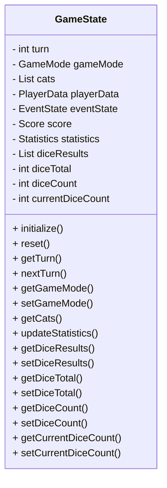
**図3-2　GameStateクラス図**

## 3.8.7 利用関係

### 利用するクラス

- SaveManager

### 利用されるクラス

- TurnManager

- EventManager

- CatManager

- 全ゲームモード

## 3.8.8 疑似コード

```
ゲーム開始                                      
                                      
                                      
↓                                      
                                      
                                      
initialize()                                      

### 出目データ初期化

GameStateの初期化時に、当ターンのサイコロ情報を以下の状態へ設定する。

- diceResults = []
- diceTotal = 0
- diceCount = 0                                      
                                      
↓                                      
                                      
                                      
ゲームモード開始                                      
                                      
                                      
↓                                      
                                      
                                      
TurnManagerから状態更新要求                                      
                                      
                                      
↓                                      
                                      
                                      
GameState更新                                      
                                      
                                      
↓                                      
                                      
                                      
イベント終了後状態更新                                      
                                      
                                      
↓                                      
                                      
                                      
ゲーム終了
```

## 3.8.9 エラー処理

**表3-6　エラー処理**

| **事象** | **処理** |
| :-: | :-: |
| 状態取得失敗 | ログ出力 |
| 不正モード | 初期モードへ復帰 |
| データ不整合 | セーブデータ再読込 |

## 3.8.10 将来拡張

GameStateは、Version 2.0以降に追加されるゲームモードおよび研究機能にも対応できるよう、保持データを容易に追加できる構造とする。

例えば、

- ケーキチャレンジ

- 色玉チャレンジ

- Alice Research Archive

- Alice Research Entry

などの状態も、本クラスに集約して管理することを想定する。

> **【設計者メモ】**

> GameStateは「ゲームを動かすクラス」ではなく、「ゲームの現在の状態を保持するクラス」である。

> 実装時には、GameStateへゲームロジックを書き込まないことを原則とする。状態管理とゲーム進行を分離することで、各ゲームモードやイベントは同じGameStateを共有しながら、それぞれ独立したロジックを実装できる。

> この責務分離は、本プロジェクト全体の保守性と拡張性を支える重要な設計方針である。

# 3.9 TurnManager

## 3.9.1 概要

TurnManagerは、ゲーム全体のターン進行を管理する共通基盤クラスである。

各ゲームモードに共通するターン開始処理、ゲーム状態更新、イベント判定、ターン終了処理を統括し、ゲーム全体の進行順序を保証する。

なお、ゲームモード固有の処理は保持せず、各ゲームモードへ処理を委譲する。

## 3.9.2 責務

TurnManagerは以下の責務を持つ。

- ターン開始処理

- 共通更新処理

- ゲームモード処理の呼び出し

- イベント判定要求

- ターン終了処理

- GameStateへのターン更新要求

## 3.9.3 保持データ

TurnManagerはゲーム状態を保持しない。

保持するのは処理に必要な参照のみとする。

**表3-7　保持データ一覧**

| **項目** | **概要** |
| :-: | :-: |
| gameState | ゲーム状態参照 |
| eventManager | イベント管理参照 |
| currentMode | 現在のゲームモード参照 |

## 3.9.4 公開メソッド

**表3-8　公開メソッド一覧**

| **メソッド** | **戻り値** | **概要** |
| :-: | :-: | :-: |
| startTurn() | void | ターン開始処理 |
| executeTurn() | void | 1ターンの進行処理 |
| endTurn() | void | ターン終了処理 |
| isGameEnd() | boolean | 終了判定 |
| nextTurn() | void | 次ターンへ移行 |

## 3.9.5 内部メソッド

**表3-9　内部メソッド一覧**

| **メソッド** | **戻り値** | **概要** |
| :-: | :-: | :-: |
| updateCommon() | void | 共通更新処理 |
| executeMode() | void | ゲームモード処理呼び出し |
| checkEvent() | boolean | イベント判定 |
| updateGameState() | void | ゲーム状態更新 |

## 3.9.6 処理フロー

TurnManagerは、詳細設計書で定義した共通ターン処理フローにしたがい、
以下の順序で処理を実行する。

1. ターン開始
2. 共通更新
3. ゲームモード処理
4. ゲーム終了判定
5. 終了条件成立時はゲーム終了処理へ移行
6. 終了条件未成立時はイベント判定
7. 必要に応じてイベント実行
8. ゲーム状態更新
9. ターン終了

## 3.9.7 クラス図
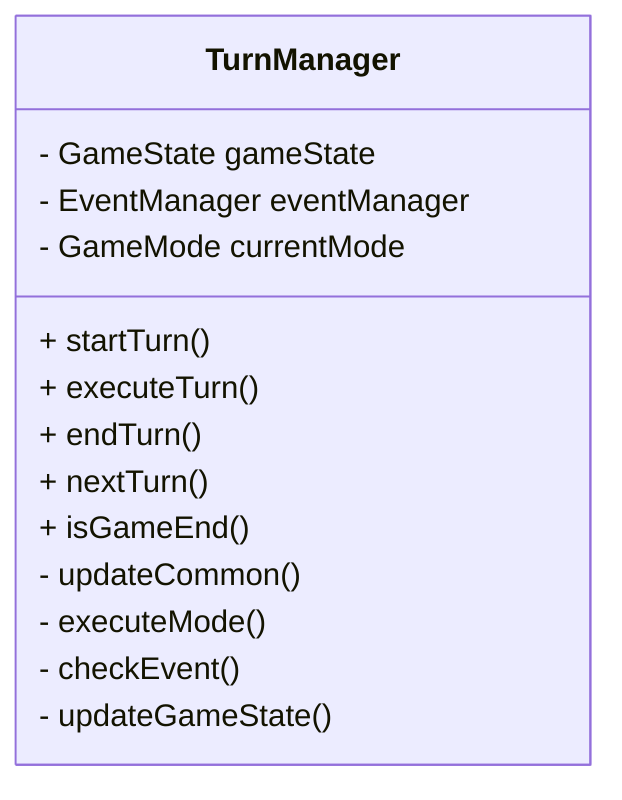
**図3-3　TurnManagerクラス図**

## 3.9.8 シーケンス概要

```
startTurn()
 ↓
updateCommon()
 ↓
executeMode()
 ↓
isGameEnd()
 ├─ Yes → GameEnd
 │
 └─ No
      ↓
   checkEvent()
      ↓
   EventManager.execute()
      ↓
   updateGameState()
      ↓
   endTurn()
```

## 3.9.9 利用関係

### 利用するクラス

- GameState

- EventManager

- 各ゲームモード

### 利用されるクラス

- Main

- GameController（ゲーム全体制御）

## 3.9.10 エラー処理

**表3-10　エラー処理**

| **事象** | **処理** |
| :-: | :-: |
| ゲームモード未設定 | 初期モードへ復帰 |
| イベント実行失敗 | ログ出力後ターン継続 |
| 状態更新失敗 | ゲーム終了処理へ移行 |

## 3.9.11 将来拡張

TurnManagerは、Version 2.0以降に追加されるゲームモードやイベントが増加した場合でも、処理順序を変更せず、ゲームモードおよびEventManagerの拡張のみで対応できる構造とする。

> **【設計者メモ】**

> TurnManagerは「ゲーム全体の進行役」であり、自らゲームルールを判断するクラスではない。

> 例えば、「猫を生成する」「勝敗を判定する」「もぐもぐチャレンジを開始する」といった処理は、それぞれCatManager、各ゲームモード、EventManagerの責務である。

> TurnManagerは「いつ」「どの順番で」処理を実行するかだけを管理する。

> この役割を維持することで、ゲームルールが変更されてもTurnManager自体をほとんど変更する必要がなくなり、保守性が向上する。

# 3.10 EventManager

## 3.10.1 概要

EventManagerは、ゲーム内イベントの発生判定、開始、実行、終了およびゲームへの復帰を管理する共通基盤クラスである。

各ゲームモードからのイベント実行要求を受け付けるとともに、イベントのライフサイクルを統一的に管理する。

イベント固有の処理は各イベントクラスへ委譲し、EventManager自身はイベント制御のみを担当する。

## 3.10.2 責務

EventManagerは以下の責務を持つ。

- イベント発生判定

- イベント開始

- イベント終了

- イベント状態管理

- イベント実行要求

- ゲームモードへの復帰

## 3.10.3 保持データ

**表3-11　保持データ一覧**

| **項目** | **概要** |
| :-: | :-: |
| currentEvent | 現在実行中イベント |
| eventQueue | イベント待機キュー |
| eventState | イベント状態 |
| gameState | ゲーム状態参照 |

## 3.10.4 公開メソッド

**表3-12　公開メソッド一覧**

| **メソッド** | **戻り値** | **概要** |
| :-: | :-: | :-: |
| checkEvent() | boolean | イベント発生判定 |
| startEvent() | void | イベント開始 |
| executeEvent() | void | イベント実行 |
| endEvent() | void | イベント終了 |
| hasEvent() | boolean | イベント有無取得 |
| getCurrentEvent() | Event | 現在イベント取得 |

## 3.10.5 内部メソッド

**表3-13　内部メソッド一覧**

| **メソッド** | **戻り値** | **概要** |
| :-: | :-: | :-: |
| selectEvent() | Event | 実行イベント選択 |
| updateEventState() | void | 状態更新 |
| restoreGameMode() | void | ゲーム復帰 |

## 3.10.6 処理概要

EventManagerは以下の手順で処理を実行する。

1. イベント発生条件確認

2. 発生確率判定

3. 実行イベント決定

4. イベント開始

5. イベント処理実行

6. ゲーム状態更新

7. イベント終了

8. ゲームモード復帰

## 3.10.7 クラス図
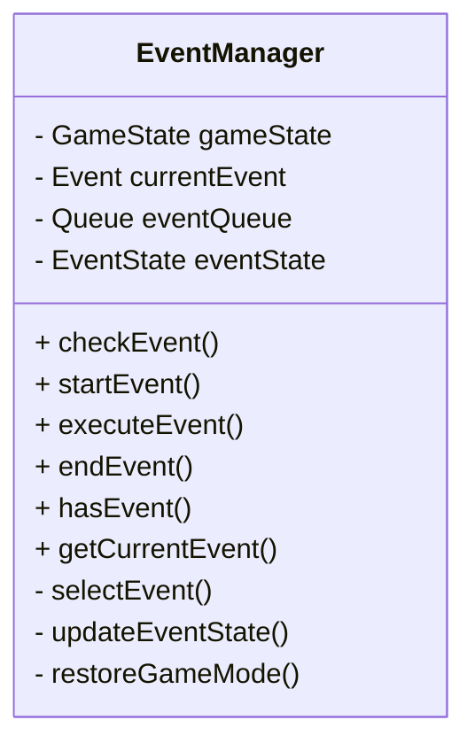
**図3-4　EventManagerクラス図**

## 3.10.8 依存関係図
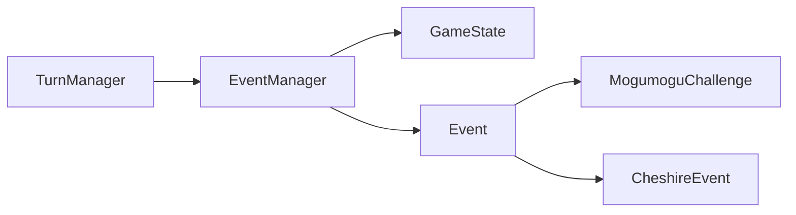
**図3-5　EventManager依存関係図**

## 3.10.9 利用関係

### 利用するクラス

- GameState

- Event（基底クラス）

- 各イベントクラス

### 利用されるクラス

- TurnManager

- 各ゲームモード

## 3.10.10 エラー処理

**表3-14　エラー処理**

| **事象** | **処理** |
| :-: | :-: |
| イベント生成失敗 | ログ出力後イベント中止 |
| イベント実行例外 | 安全終了後ゲームへ復帰 |
| イベント終了失敗 | 状態初期化後ゲーム継続 |

## 3.10.11 将来拡張

新規イベントは、Eventクラスを継承することで追加可能とする。

EventManager自体は変更せず、イベントクラスのみ追加することを基本方針とする。

対象例

- ケーキチャレンジ

- 色玉チャレンジ

- 季節イベント

- 特殊研究イベント

> **【設計者メモ】**

> EventManagerは「イベントを実行するクラス」ではなく、「イベントを管理するクラス」である。

> 例えば「もぐもぐチャレンジ」の判定処理や「チェシャ猫イベント」の効果適用は、それぞれのイベントクラスが担当する。

> EventManagerは、「どのイベントを」「いつ開始し」「いつ終了するか」というライフサイクルのみを管理する。

> この構造を維持することで、Version 2.0以降に新しいイベントを追加しても、EventManagerは変更せずに拡張できる。

# 3.11 CatManager

## 3.11.1 概要

CatManagerは、ゲーム内に存在する招き猫の生成、更新、削除および管理を行う共通基盤クラスである。

ゲームモードに依存しない共通機能として招き猫のライフサイクルを管理し、各ゲームモードはCatManagerを介して招き猫を操作する。

ClassicRuleのフェーズ1では、出目Xに対してcreateCat()をX回呼び出す。
各個体は独立したCatとして管理する。

なお、招き猫固有のゲームルールは各ゲームモードが担当し、CatManagerは管理機能のみを提供する。

## 3.11.2 責務

CatManagerは以下の責務を持つ。

- 招き猫生成

- 招き猫削除

- 招き猫一覧管理

- 招き猫状態更新

- 寿命更新要求（アリスモード）

- 招き猫検索

- 招き猫データ取得

## 3.11.3 保持データ

**表3-15　保持データ一覧**

| **項目** | **概要** |
| :-: | :-: |
| cats | 招き猫一覧 |
| nextCatId | 招き猫ID採番 |
| gameState | ゲーム状態参照 |

## 3.11.4 公開メソッド

**表3-16　公開メソッド一覧**

| **メソッド** | **戻り値** | **概要** |
| :-: | :-: | :-: |
| createCat() | Cat | 招き猫生成 |
| removeCat() | void | 招き猫削除 |
| getCat() | Cat | 招き猫取得 |
| getCats() | List\<Cat\> | 招き猫一覧取得 |
| updateCats() | void | 招き猫状態更新 |
| updateLifetime() | void | 寿命更新 |
| clear() | void | 全招き猫削除 |

## 3.11.5 内部メソッド

**表3-17　内部メソッド一覧**

| **メソッド** | **戻り値** | **概要** |
| :-: | :-: | :-: |
| generateId() | int | ID採番 |
| deleteExpiredCats() | void | 寿命0の招き猫削除 |
| validateCat() | boolean | 整合性確認 |

## 3.11.6 処理概要

CatManagerは以下の手順で招き猫を管理する。

1. 新規招き猫生成

2. 一覧へ登録

3. 状態更新

4. 必要に応じて寿命更新

5. 寿命0の招き猫削除

6. 最新状態をGameStateへ反映

## 3.11.7 クラス図

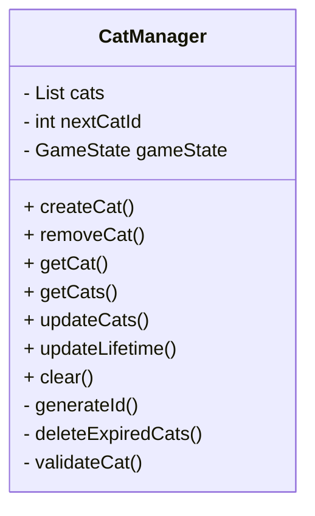
**図3-6　CatManagerクラス図**

## 3.11.8 依存関係図
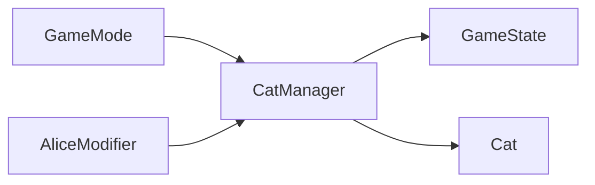
**図3-7　CatManager依存関係図**

## 3.11.9 利用関係

### 利用するクラス

- GameState

- Cat

### 利用されるクラス

- ClassicMode

- CollectorMode

- AliceModifier

- BattleMode

## 3.11.10 エラー処理

**表3-18　エラー処理**

| **事象** | **処理** |
| :-: | :-: |
| 生成失敗 | ログ出力 |
| 削除対象なし | 処理継続 |
| ID重複 | 再採番 |
| 一覧不整合 | 再構築 |

## 3.11.11 将来拡張

CatManagerは、新しい招き猫の種類や属性が追加された場合でも、既存処理を変更せずに対応できる構造とする。

また、Version 2.0以降で予定されている研究所機能との連携に備え、招き猫の観測データや取得履歴などの管理機能を追加できる設計とする。

## 3.11.12 関連データモデル：Cat
### 3.11.12.1 概要
`Cat` は、ゲーム内に存在する1個体の招き猫を表すデータモデルである。

招き猫の個体識別情報、色、残り寿命、生成ターンを保持する。

Cat自身はゲーム進行や招き猫一覧の管理を行わず、
1個体の状態を保持することを主な責務とする。

### 3.11.12.2 保持データ
**表3-19　Cat保持データ一覧**
| 項目 | 型 | 概要 |
|---|---|---|
| id | int | 招き猫個体を識別するID |
| color | CatColor | 招き猫の色 |
| lifetime | int / Infinity | 招き猫個体の残り寿命 |
| createdAt | int | 招き猫が生成されたターン |

> **【設計者メモ】**

> CatManagerは「招き猫を管理するクラス」であり、「ゲームルールを決定するクラス」ではない。

> 例えば、「猫を生成できるか」「寿命を減らす条件は何か」「取得条件を満たしているか」といった判断は、それぞれゲームモードやイベントの責務である。

> CatManagerは、その判断結果に基づいてデータを更新することだけを担当する。

> この役割を維持することで、今後新しいゲームモードが追加されても、CatManagerは共通基盤として利用し続けることができる。

### 3.11.12.3 責務
Catは、1個体の招き猫に関する状態を保持する。

Cat自身は以下の処理を担当しない。

- 招き猫の生成
- 招き猫一覧の管理
- 招き猫の削除
- 寿命更新処理
- 寿命0の招き猫の削除判定
- ゲーム進行判定

これらの処理はCatManagerまたは各ゲームモード・Modifier側が担当する。

### 3.11.12.4 生成
CatはCatManagerから生成される。

CatManagerは自身のID採番機構を使用して招き猫個体のIDを生成し、
生成時のゲーム状態に基づいてcreatedAtおよびlifetimeを設定する。

Cat自身は個体IDの採番処理を行わない。

### 3.11.12.5 状態更新
Cat自身は、ゲーム進行に伴う状態更新処理を実行しない。

招き猫の状態更新および寿命更新はCatManagerが担当する。

寿命0となった招き猫の削除についてもCatManagerが担当する。

### 3.11.12.6 利用関係
Catは主としてCatManagerから利用される。

GameStateは招き猫一覧を保持し、
CatManagerはCatの生成・管理・状態更新を担当する。

関係は以下のとおりとする。

GameState
    │
    └── cats
          │
          └── Cat

CatManager
    │
    └── Cat

### 3.11.12.7 エラー処理
Cat自身ではゲーム進行上のエラー処理を行わない。

Catの整合性確認はCatManagerのvalidateCat()が担当する。

Catの生成失敗、ID重複、一覧不整合等については、
CatManagerのエラー処理に従う。

### 3.11.12.8 将来拡張
Version 2.0以降で新しい招き猫の種類や属性を追加する場合、
Catの保持データを拡張できる構造とする。

ただし、ゲームモード固有のルールやゲーム進行処理を
Cat自身へ直接追加することは避け、
必要に応じてCatManager、GameModeまたはModifier側で処理する。

# 3.12 RandomManager

## 3.12.1 概要

RandomManagerは、ゲーム全体で使用する乱数生成および確率判定を提供する共通基盤クラスである。

ゲームモード、イベントおよび各種判定処理は、本クラスを介して乱数を取得することにより、乱数生成方法を統一する。

乱数生成アルゴリズムは本クラスへ集約し、各クラスで独自に乱数生成を行わないものとする。

## 3.12.2 責務

RandomManagerは以下の責務を持つ。

- 乱数生成

- 確率判定

- 範囲指定乱数生成

- サイコロ生成

- シード管理（将来拡張）

## 3.12.3 保持データ

**表3-20 保持データ一覧**

| **項目** | **概要** |
| :-: | :-: |
| random | 乱数生成器 |
| seed | 乱数シード（任意） |

seed は乱数生成器の再現性を確保するために使用する任意のシード値である。通常プレイではシードを固定せず、デバッグ・検証時にのみ固定値を設定できるものとする。

## 3.12.4 公開メソッド

**表3-21　公開メソッド一覧**

| **メソッド** | **引数** | **戻り値** | **概要** |
| :-: | :-: | :-: | :-: |
| nextInt(min, max) | min, max | int | 整数乱数取得 |
| nextDouble() | なし | double | 実数乱数取得 |
| rollDice() | なし | int | 6面サイコロ生成 |
| checkProbability(probability) | probability | boolean | 確率判定 |
| setSeed(seed) | seed | void | シード設定 |

## 3.12.5 内部メソッド

**表3-22　内部メソッド一覧**

| **メソッド** | **戻り値** | **概要** |
| :-: | :-: | :-: |
| initializeRandom() | void | 乱数生成器初期化 |
| validateProbability(probability) | boolean | 確率範囲確認 |

## 3.12.6 処理概要

RandomManagerは以下の手順で乱数を提供する。

1. 必要に応じて乱数生成器を初期化する。
2. 呼び出し元から指定された条件に従って乱数を生成する。
3. 確率判定の場合は、指定された確率値の妥当性を確認する。
4. 必要に応じてシード値を設定する。
5. 生成結果または判定結果を呼び出し元へ返却する。

## 3.12.7 クラス図
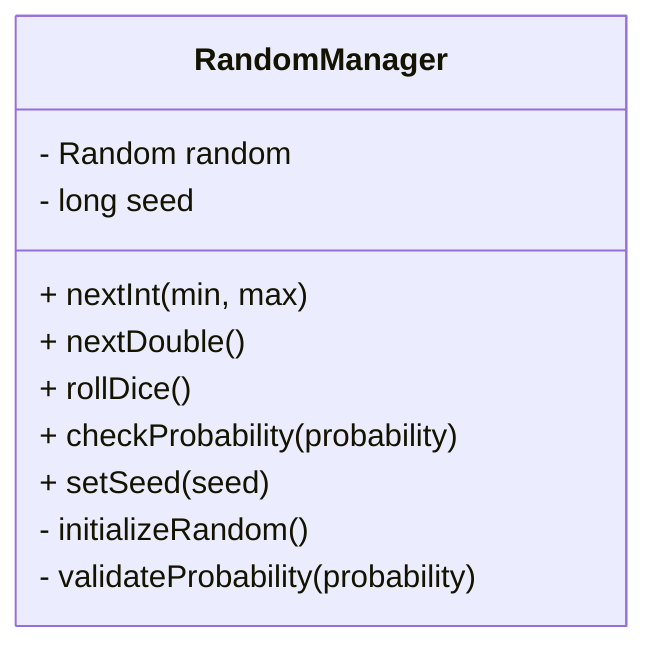
**図3-8　RandomManagerクラス図**

## 3.12.8 依存関係図
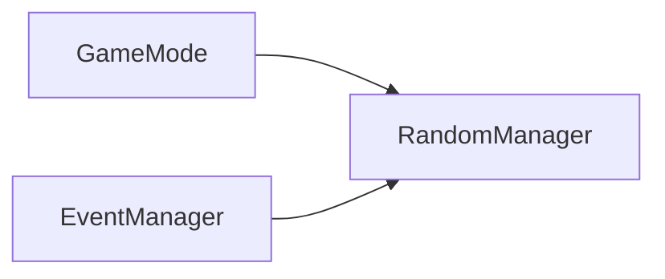
**図3-9　RandomManager依存関係図**
## 3.12.9 利用関係

### 利用するクラス

なし（共通基盤）

### 利用されるクラス

- GameMode

- EventManager

- MogumoguChallengeEvent

- CheshireEvent

将来的には

- CakeChallenge

- DonutChallenge

- ClockChallenge

- ColorBallChallenge

からも利用される。

## 3.12.10 エラー処理

**表3-23　エラー処理**

| **事象** | **処理** |
| :-: | :-: |
| probability が0未満または1超過 | 例外送出 |
| min > max | 例外送出 |
| 乱数生成失敗 | 再生成 |
| シード設定失敗 | デフォルト初期化 |

## 3.12.11 将来拡張

Version 1.0では、通常プレイ時の乱数はシードを固定せず生成する。setSeed(seed) は主としてデバッグ・検証用途で使用する。

Version 2.0以降では、乱数シードの固定、乱数生成履歴の記録、確率実験および統計解析との連携などを拡張できる構造とする。

また、確率実験や統計機能との連携を考慮し、研究所機能から乱数生成器を利用できるよう拡張することを想定する。

> **【設計者メモ】**

> RandomManagerは「乱数を作るクラス」であると同時に、「ゲーム全体の再現性を保証するクラス」でもある。

> すべての乱数を本クラスへ集約することで、デバッグ時にはシードを固定し、同じ状況を再現できる。

> また、将来的に研究所で確率実験や統計解析を行う際も、本クラスを利用することで、本編と同じ乱数環境を再現できる。

# 3.13 SaveManager

## 3.13.1 概要

SaveManagerは、ゲーム状態の保存および読込を管理する共通基盤クラスである。

GameStateを中心としたゲーム全体の状態を永続化し、ゲームの再開および継続プレイを可能とする。

保存対象となるデータは本クラスで一元管理し、各ゲームモードはSaveManagerを介してセーブ・ロードを実行する。

## 3.13.2 責務

SaveManagerは以下の責務を持つ。

- セーブデータ作成

- セーブデータ読込

- セーブデータ削除

- セーブデータ整合性確認

- GameStateとの同期

- バージョン情報管理

## 3.13.3 保持データ

**表3-24　保持データ一覧**

| **項目** | **概要** |
| :-: | :-: |
| gameState | ゲーム状態参照 |
| saveVersion | セーブデータVersion |
| savePath | 保存先情報 |

## 3.13.4 公開メソッド

**表3-25　公開メソッド一覧**

| **メソッド** | **戻り値** | **概要** |
| :-: | :-: | :-: |
| save() | boolean | ゲーム状態保存 |
| load() | boolean | ゲーム状態読込 |
| deleteSave() | boolean | セーブデータ削除 |
| exists() | boolean | セーブデータ存在確認 |
| getSaveVersion() | String | 保存Version取得 |

## 3.13.5 内部メソッド

**表3-26　内部メソッド一覧**

| **メソッド** | **戻り値** | **概要** |
| :-: | :-: | :-: |
| serialize() | SaveData | 保存データ生成 |
| deserialize() | GameState | 保存データ復元 |
| validateVersion() | boolean | Version確認 |
| backup() | void | バックアップ作成 |

## 3.13.6 処理概要

SaveManagerは以下の手順で処理を行う。

1. GameState取得

2. 保存データ生成

3. Version情報付与

4. 永続化

5. 保存完了通知

ロード時は逆順で処理を行う。

## 3.13.7 クラス図
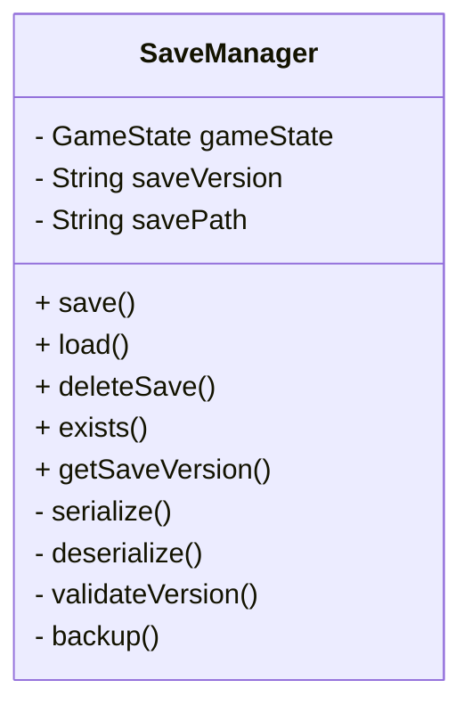
**図3-10　SaveManagerクラス図**

## 3.13.8 依存関係図
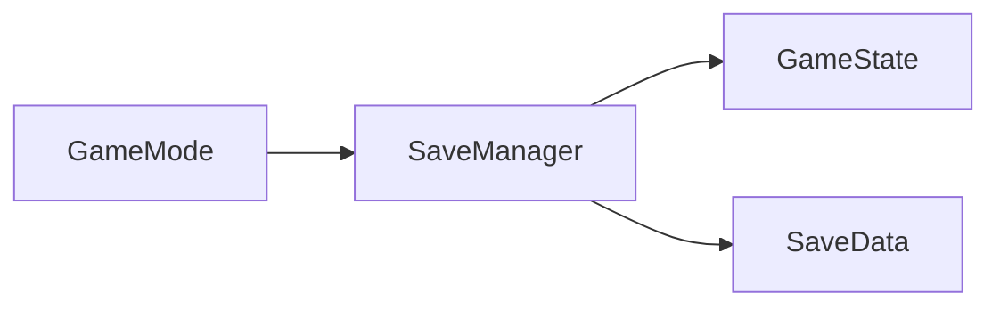
**図3-11　SaveManager依存関係図**

## 3.13.9 利用関係

### 利用するクラス

- GameState

- SaveData

### 利用されるクラス

- メインメニュー

- 各ゲームモード

## 3.13.10 エラー処理

**表3-27　エラー処理**

| **事象** | **処理** |
| :-: | :-: |
| 保存失敗 | ログ出力後リトライ |
| ロード失敗 | タイトル画面へ復帰 |
| Version不一致 | 互換性確認処理実行 |
| データ破損 | バックアップから復元 |

## 3.13.11 将来拡張

Version 2.0以降では、以下の機能追加を想定する。

- セーブスロット複数対応

- オートセーブ

- クラウド保存対応

- 研究所データとの連携

- Archive進捗保存

- Entry解放状況保存

> **【設計者メモ】**

> SaveManagerは「ファイルへ保存するクラス」ではなく、「ゲーム状態を永続化する仕組み」を提供するクラスである。

> 保存形式（JSON、SQLite等）は、本クラスの外部へ影響を与えないよう抽象化する。

> また、セーブデータには必ずVersion情報を保持し、将来のVersionアップ時に互換性を維持できる設計とする。

# 第4章　PlayRule実装

## 4.1 目的

本章では、「招き猫ゲーム」におけるプレイルール（PlayRule）の実装方法を定義する。

PlayRuleは、ゲーム本編のルールを定義する実装単位であり、ゲームの進行方法、勝敗条件およびゲーム固有の処理を提供する。

また、RuleModifierを適用することにより、基本ルールへ追加ルールを組み合わせることができる。

BattleModeは、本章で定義するPlayRuleを利用して対戦を実現する。

## 4.2 PlayRule概要

PlayRuleは、ゲーム本編における基本ルールを定義するインターフェース（または抽象クラス）である。

すべてのPlayRuleは共通のライフサイクルを持ち、TurnManagerはPlayRuleの種類を意識することなくゲームを進行できる。

また、RuleModifierを適用することで、新たなプレイルールを構築できる。

## 4.3 PlayRule構成

```
                  PlayRule                        
                        
                      │                        
                        
          ┌───────────┴───────────┐                        
                        
          ▼                       ▼                        
                        
    ClassicRule             CollectorRule                        
                        
          │                       │                        
                        
          └───────────┬───────────┘                        
                        
                      │                        
                        
               AliceModifier                        
                        
                      │                        
                        
          ┌───────────┴───────────┐                        
                        
          ▼                       ▼                        
                        
 ClassicRule＋Alice       CollectorRule＋Alice
```

**図4-1　PlayRule構成**

## 4.4 PlayRuleインターフェース

### 4.4.1 概要

PlayRuleは、すべてのゲームルールが実装する共通インターフェースである。

ゲーム固有のルールは各PlayRuleが担当し、共通処理はTurnManagerおよび共通基盤へ委譲する。

### 4.4.2 責務

PlayRuleは以下の責務を持つ。

- ゲーム初期化

- ターン実行

- 勝敗判定

- ゲーム終了判定

- ゲーム終了処理

### 4.4.3 公開メソッド

**表4-1　公開メソッド一覧**

| **メソッド** | **戻り値** | **概要** |
| :-: | :-: | :-: |
| initialize() | void | ゲーム初期化 |
| executeTurn() | void | 1ターン実行 |
| checkResult() | void | 当ターンのゲーム結果を判定する |
| isFinished() | boolean | 終了判定 |
| terminate() | void | 終了処理 |
| canDropout() | boolean | ドロップアウト可能判定 |
| executeDropout() | void | ドロップアウト処理 |
| executeGamblerAlice() | void | 勝負師アリス処理 |

isFinished()については、猫数が0になったフェーズ処理の直後に終了することとし、判定条件は以下のとおりとする。
**gameState.getCats().size() <= 0**

GameStateでは招き猫一覧をcatsとして管理し、
招き猫数はcats.size()から取得する。
catCountは独立した状態として保持しない。

### 4.4.4 クラス図
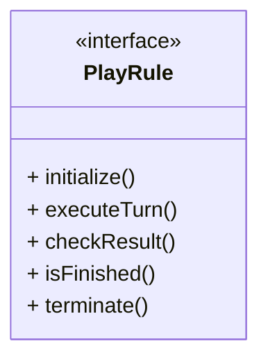
**図4-2　PlayRuleインターフェース**

### 4.4.5 利用関係

#### 利用されるクラス

- TurnManager

- BattleMode

#### 実装クラス

- ClassicRule

- CollectorRule

### 4.4.6 設計方針

PlayRuleは「ゲームルール」を表現するための共通契約であり、ゲームモードやイベント、UIには依存しない。

ゲーム固有のロジックはPlayRuleへ実装し、状態管理やイベント管理などの共通処理は共通基盤へ委譲する。

> **【設計者メモ】**

> PlayRuleは「ゲームの遊び方」を表現する最も重要な抽象化である。

> Version 1.0では `ClassicRule` と `CollectorRule` の2種類を基本ルールとし、`AliceModifier` を適用することで「アリスモード」および「コレクター＋アリスモード」を構成する。

> プレイヤーには「アリスモード」という名称で表示されるが、実装上は **ClassicRule + AliceModifier** の組み合わせとして扱う。

> BattleModeはPlayRuleを利用して対戦を実現するため、新しいPlayRuleが追加されてもBattleMode自体を変更する必要はない。

# 4.5 RuleModifier

## 4.5.1 概要

RuleModifierは、PlayRuleへ追加ルールを適用するための共通インターフェース（または抽象クラス）である。

PlayRuleの基本ルールを変更することなく、新たなゲームルールを付加することを目的とする。

Version 1.0ではAliceModifierのみを実装する。

## 4.5.2 責務

RuleModifierは以下の責務を持つ。

- PlayRuleへの追加ルール適用

- ターン処理への介入

- ゲーム状態更新

- 必要に応じたイベント追加

## 4.5.3 公開メソッド

**表4-2　公開メソッド一覧**

| **メソッド** | **戻り値** | **概要** |
| :-: | :-: | :-: |
| initialize() | void | Modifier初期化 |
| beforeTurn() | void | ターン開始前処理 |
| afterTurn() | void | ターン終了後処理 |
| terminate() | void | 終了処理 |

## 4.5.4 クラス図
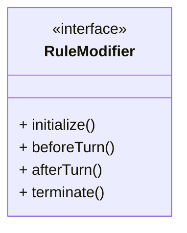
**図4-3　RuleModifierインターフェース**

## 4.5.5 利用関係

### 利用されるクラス

- ClassicRule

- CollectorRule

- BattleMode（PlayRule経由）

### 実装クラス

- AliceModifier

## 4.5.6 設計方針

RuleModifierは、PlayRuleを変更せずに追加ルールを提供する。

複数のRuleModifierを組み合わせられる設計とし、将来的な機能追加に対応できる構造とする。

Version 1.0ではAliceModifierのみを対象とする。

> **【設計者メモ】**

> RuleModifierは、ゲームルールを置き換えるものではなく、既存のPlayRuleへ追加機能を付与するための仕組みである。

> PlayRuleの責務を肥大化させることなく、新しいルールを追加できることを目的としている。

# 4.6 AliceModifier

## 4.6.1 概要

AliceModifierは、PlayRuleへ「アリスルール」を追加するRuleModifier実装クラスである。

本Modifierを適用したPlayRuleは、招き猫へ寿命（Lifetime）の概念を付与し、ターン経過による寿命管理を行う。

プレイヤーからは「アリスモード」として表示されるが、実装上はPlayRuleへAliceModifierを適用した構成となる。

## 4.6.2 責務

AliceModifierは以下の責務を持つ。

- 招き猫寿命更新

- 寿命切れ招き猫削除

- アリスモード固有イベント制御

- アリス状態管理

## 4.6.3 保持データ

**表4-3　保持データ一覧**

| **項目** | **概要** |
| :-: | :-: |
| gameState | ゲーム状態参照 |
| catManager | 招き猫管理参照 |
| targetTurns | プレイヤーが設定したアリスモードの目標ターン数※ |

※初期値：20とし、設定可能範囲：1～999とする。

## 4.6.4 公開メソッド

**表4-4　公開メソッド一覧**

| **メソッド** | **戻り値** | **概要** |
| :-: | :-: | :-: |
| initialize() | void | 初期化 |
| beforeTurn() | void | 寿命更新 |
| afterTurn() | void | 削除・イベント処理 |
| terminate() | void | 終了処理 |

## 4.6.5 内部メソッド

**表4-5　内部メソッド一覧**

| **メソッド** | **戻り値** | **概要** |
| :-: | :-: | :-: |
| updateLifetime() | void | 寿命更新 |
| removeExpiredCats() | void | 寿命切れ削除 |
| checkVictory() | void | 勝利条件 |
| checkDefeat() | void | 敗北条件 |


## 4.6.6 処理概要

AliceModifierはターンごとに以下の処理を実行する。

【ターン開始】
      ↓
寿命更新
      ↓
寿命0を削除
      ↓
勝利判定
      ↓
敗北判定
      ↓
サイコロ・通常ゲーム処理
      ↓
イベント判定
      ↓
【ターン終了】

## 4.6.7 クラス図
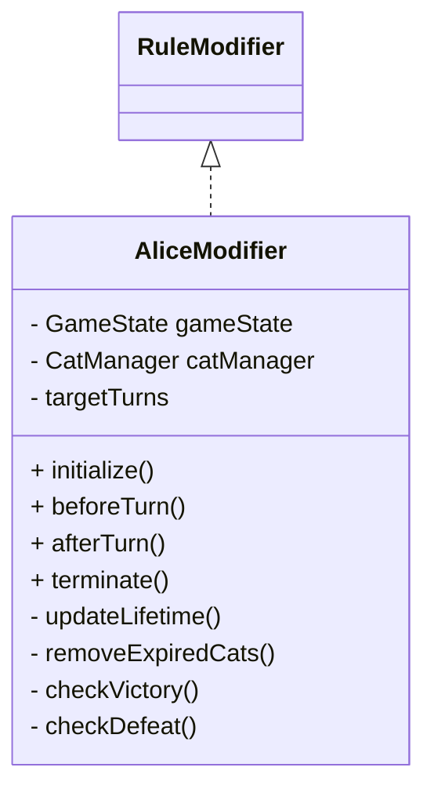
**図4-4　AliceModifierクラス図**

## 4.6.8 依存関係図
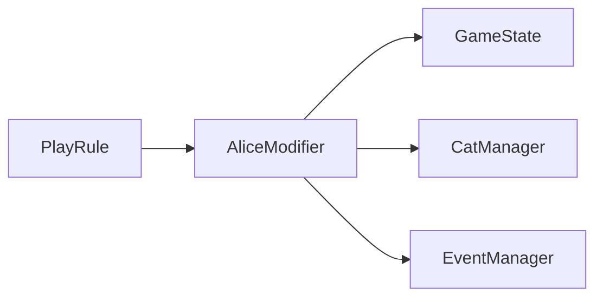
**図4-5　AliceModifier依存関係図**

## 4.6.9 利用関係

### 利用するクラス

- GameState

- CatManager

- EventManager

### 利用されるクラス

- ClassicRule

- CollectorRule

## 4.6.10 エラー処理

**表4-6　エラー処理**

| **事象** | **処理** |
| :-: | :-: |
| 寿命更新失敗 | ログ出力 |
| 削除失敗 | 次ターンで再試行 |
| イベント実行失敗 | ゲーム継続 |

## 4.6.11 将来拡張

AliceModifierは、Version 2.0以降に追加される新たなRuleModifierと共存できる構造とする。

複数のModifierを適用する場合でも、各Modifierは独立して処理を実装する。

> **【設計者メモ】**

> AliceModifierは「アリスモードそのもの」ではなく、「アリスルールを追加するコンポーネント」である。

> 例えば「アリスモード」は **ClassicRule + AliceModifier**、「コレクター＋アリスモード」は **CollectorRule + AliceModifier** として構成される。

> この設計により、PlayRuleとアリスルールを独立して保守・拡張できる。

# 4.7 ClassicRule

## 4.7.1 概要

ClassicRuleは、「招き猫ゲーム」における最も基本となるプレイルールを実装するクラスである。

プレイヤーはサイコロを振り、現在のサイコロ数に応じたフェーズ処理を実行する。

本ルールでは、サイコロ数が1個の場合をフェーズ1、2個以上の場合をフェーズ2として扱う。

フェーズ1では、サイコロの出目に応じて招き猫を生成する。

フェーズ2では、全サイコロの出目合計を素数判定し、その結果に応じて招き猫数及び次ターンのサイコロ数を更新する。

ClassicRuleは、システム仕様書で定義されたクラシックモードの基本ルールを実装する基準クラスとして位置付ける。

追加ルールは、原則としてRuleModifier等の拡張機構によって実現する。

## 4.7.2 責務

ClassicRuleは以下の責務を持つ。

- ターン処理の実行
- サイコロ処理
- フェーズ判定
- フェーズ1における招き猫生成
- フェーズ2における出目合計の素数判定
- フェーズ2における招き猫数更新
- フェーズ2におけるサイコロ数更新
- ゲーム終了判定
- 終了処理
- ドロップアウト処理
- 勝負師アリス処理

ClassicRuleはゲーム状態そのものを直接管理せず、GameState、CatManager、RandomManager等の共通基盤を利用する。

## 4.7.3 保持データ

**表4-7　保持データ一覧**

| **項目** | **概要** |
| :-: | :-: |
| gameState | ゲーム状態参照 |
| catManager | 招き猫管理 |
| randomManager | 乱数・サイコロ処理 |
| modifiers | ルール拡張情報 |

ゲームデータそのものは保持せず、共通基盤を利用する。

なお、現在のサイコロ数はGameStateが保持する currentDiceCount を参照する。

## 4.7.4 公開メソッド

**表4-8　公開メソッド一覧**

| **メソッド** | **戻り値** | **概要** |
| :-: | :-: | :-: |
| initialize() | void | クラシックルール初期化 |
| executeTurn() | void | 1ターン実行 |
| checkResult() | void | 当ターンのゲーム結果を判定する |
| isFinished() | boolean | ゲーム終了判定 |
| terminate() | void | 終了処理 |
| canDropout() | boolean | ドロップアウト可能判定 |
| executeDropout() | void | ドロップアウト処理 |
| executeGamblerAlice() | void | 勝負師アリス処理 |

**備考**

executeTurn() は1ターンのルール処理を実行する。ゲーム終了状態の判定は isFinished() が担当する。

checkResult() は、フェーズ2における出目合計の結果判定に利用する。

## 4.7.5 内部メソッド

**表4-9　内部メソッド一覧**

| **メソッド** | **戻り値** | **概要** |
| :-: | :-: | :-: |
| rollDice() | void | 現在のサイコロ数にしたがってサイコロを振る |
| determinePhase() | void | サイコロ数からフェーズを判定する |
| generateCats() | void | フェーズ1で出目の数だけ招き猫を生成する |
| processPhase2() | void | フェーズ2の素数判定及び状態更新を行う |
| isPrime() | boolean | 出目合計が素数か判定する |
| updateCatCount() | void | フェーズ2の招き猫数を更新する |
| updateDiceCount() | void | フェーズ2のサイコロ数を更新する |

**設計上の注意**

招き猫生成処理はフェーズ1の場合のみ実行する。

フェーズ2では招き猫生成処理を実行せず、既存の招き猫数に対する更新処理を行う。

## 4.7.6 処理概要

ClassicRuleは、システム仕様書で定義したクラシックモード処理フローにしたがい、
以下の順序で処理を行う。

1. 現在のサイコロ数を取得
2. サイコロを振る
3. 出目一覧及び出目合計をGameStateへ保存
4. 現在のサイコロ数に基づきフェーズを判定
5. フェーズ処理を実行
6. 招き猫数が0になった場合は即時終了
7. イベント判定
8. ゲーム状態を更新
9. 終了条件を判定

フェーズ処理は現在のサイコロ数に応じて以下のように分岐する。

【フェーズ1】
サイコロ数が1個の場合、
出目をXとし、招き猫をX匹生成する。
処理後、次ターンのサイコロ数を2個とする。

【フェーズ2】
サイコロ数が2個以上の場合、
全サイコロの出目合計をSとして素数判定を行う。

Sが素数の場合、
招き猫数Mを

M ← M − |S − M|

で更新し、
サイコロ数を1個増加させる。

Sが素数でない場合、
招き猫数を変更せず、
サイコロ数を1個減少させる。

サイコロ数は1個未満にならないものとする。

招き猫数が0となった場合は、即時にゲーム終了処理へ移行し、
以降のイベント処理及び次ターン処理を実行しない。

イベント判定およびターン管理は共通基盤が担当する。

サイコロ処理によって得られた出目一覧、出目合計、使用サイコロ数はGameStateへ保存し、後続の招き猫生成処理から参照する。

ドロップアウト処理は4.10ドロップアウト実装にしたがう。

ClassicRuleではクラシックモード固有の判定のみ実装する。

### 4.7.6.1 フェーズ判定
現在のサイコロ数を N とする。

N = 1
    → フェーズ1

N >= 2
    → フェーズ2

サイコロ数は1未満にならないものとする。

### 4.7.6.2 フェーズ1処理
フェーズ1では、サイコロを1個使用する。

1. サイコロを1個振る。
2. 出目を X とする。
3. X 匹の招き猫を生成する。
4. 生成された招き猫をCatManagerへ登録する。
5. 次ターンのサイコロ数を2個とする。

生成される招き猫数は出目と同じとする。

**表4-10　生成招き猫数一覧**

| **出目** | **生成数** |
| :-: | :-: |
| 1 | 1匹 |
| 2 | 2匹 |
| 3 | 3匹 |
| 4 | 4匹 |
| 5 | 5匹 |
| 6 | 6匹 |

生成された招き猫は個体単位で管理する。

同一ターンに複数の招き猫を生成した場合も、生成順序を維持する。

### 4.7.6.3 フェーズ2処理
フェーズ2では、2個以上のサイコロを使用する。

各サイコロの出目を合計し、出目合計を S とする。

現在存在する招き猫数を M とする。

出目合計 S が素数の場合、招き猫数を以下の式により更新する。

    M′=max(0,M−∣S−M∣)

実際に削除する招き猫数 D は、

    D=min(M,∣S−M∣)

とする。

D 匹の招き猫を削除し、更新後の招き猫数を M' とする。

削除対象の順序はCatManagerの管理順とする。

**素数の場合**

出目合計 S が素数の場合、
- 招き猫数を更新する
- 次ターンのサイコロ数を1個増加させる
ものとする。

**非素数の場合**

出目合計 S が素数でない場合、
- 招き猫数は変更しない
- 次ターンのサイコロ数を1個減少させる
ものとする。

ただし、サイコロ数は1未満にならない。

したがって、サイコロ数が1となった場合、次ターンは必ずフェーズ1として処理する。

### 4.7.6.4 素数判定
フェーズ2では、各サイコロの出目そのものではなく、全サイコロの出目合計 S を素数判定する。

例えば、

    出目 [4, 1]
    S = 5

の場合、5は素数であるため、素数結果として扱う。

一方、

    出目 [6, 3]
    S = 9

の場合、9は素数ではないため、非素数結果として扱う。

素数判定はClassicRuleのフェーズ2処理において実行する。

### 4.7.6.5 招き猫削除処理
フェーズ2において招き猫を削除する場合、生成順の古い招き猫から削除する。

CatManagerは招き猫を生成順に管理する。

したがって、削除対象は管理配列上の先頭から選択する。

同一ターンに複数の招き猫が生成された場合も、生成順序を維持する。

なお、招き猫数が0未満になることはない。

計算結果が0未満となる場合は0として扱う。

### 4.7.6.6 サイコロ数更新
フェーズ処理終了後、次ターンのサイコロ数を更新する。

**フェーズ1**

    現在のサイコロ数 = 1
    ↓
    次ターン = 2

**フェーズ2・素数**

    現在のサイコロ数 + 1

**フェーズ2・非素数**

    現在のサイコロ数 - 1

ただし、次ターンのサイコロ数は1未満にならない。

### 4.7.6.7 ゲーム終了判定
フェーズ処理によって招き猫数が0となった場合、ゲームを即時終了する。

この場合、
- イベント判定
- イベント実行
- ゲーム状態更新
- 次ターン開始

を実行しない。

ゲーム終了処理へ直接移行する。

招き猫数は内部的にも0未満にならない。

## 4.7.7 ゲーム状態との連携
ClassicRuleは、ターン中に確定したデータをGameStateへ保存する。

以下のデータをGameStateで管理する。

**表4-11　GameState管理データ一覧**

| **データ** | **GameState項目** |
| :-: | :-: |
| 出目一覧 | diceResults |
| 出目合計 | diceTotal |
| 使用サイコロ数 | diceCount|
| 次ターンのサイコロ数 |currentDiceCount |
| 招き猫一覧 | cats |

サイコロ処理では、出目一覧、出目合計及び使用サイコロ数を保存する。

フェーズ処理では、現在のゲーム状態を参照して招き猫及びサイコロ数を更新する。

### 4.7.8 CatManagerとの連携
ClassicRuleは招き猫そのものを直接管理せず、CatManagerを介して招き猫を操作する。

**フェーズ1**
出目 X に対して、

    CatManager.createCat()

を X 回呼び出す。

各招き猫には、必要な初期状態を設定する。

現在の基本実装では、生成ターンを GameState.getTurn() により取得する。

**フェーズ2**
削除が必要な場合は、生成順の古い招き猫から対象を決定し、

    CatManager.removeCat()

を利用して削除する。

CatManagerは削除後の招き猫一覧をGameStateへ同期する。

## 4.7.9 クラス図
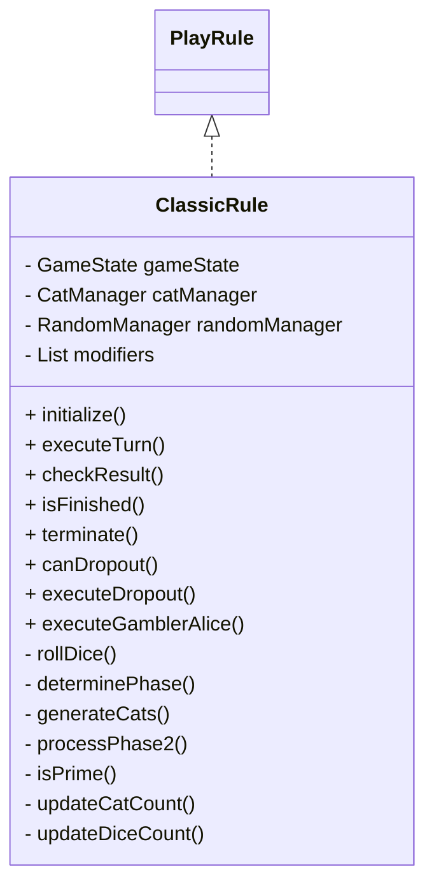
**図4-6　ClassicRuleクラス図**

## 4.7.10 依存関係図
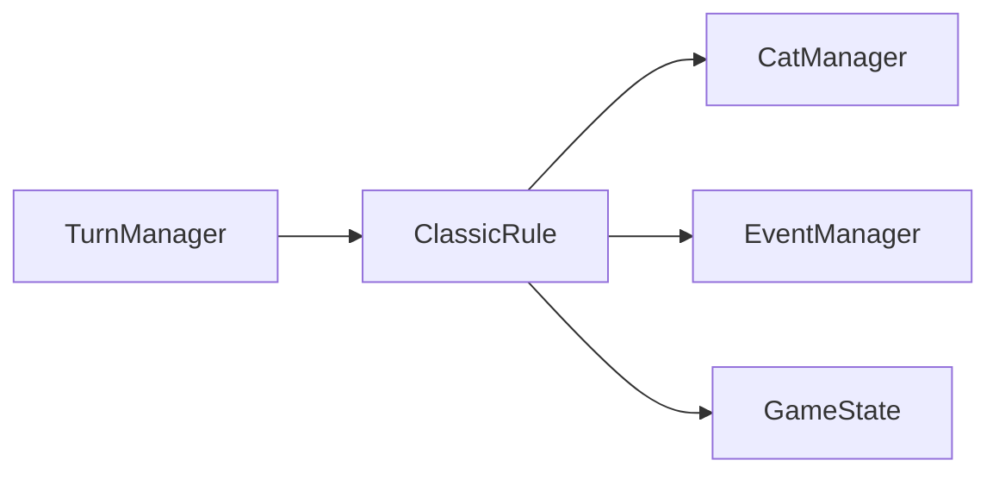
**図4-7　ClassicRule依存関係図**

## 4.7.11 利用関係

### 利用するクラス

- GameState

- CatManager

- EventManager

### 利用されるクラス

- TurnManager

- BattleMode

## 4.7.12 エラー処理

**表4-12　エラー処理**

| **事象** | **処理** |
| :-: | :-: |
| サイコロ処理失敗 | 共通エラー処理へ移行 |
| 招き猫生成失敗 | ログ出力後、処理を継続 |
| 招き猫削除対象なし | 処理を継続 |
| 素数判定異常 | ログ出力後、共通エラー処理へ移行 |
| ゲーム状態更新失敗 | 共通エラー処理へ移行 |

## 4.7.13 将来拡張

ClassicRuleは、ゲーム本編における基準ルールとして位置付ける。

Version 2.0以降も基本ルール自体は変更せず、新しいルール追加はRuleModifierによって実現することを原則とする。

フェーズ1及びフェーズ2の基本構造は維持し、新しいルールを追加する場合も既存の基本処理を破壊しない構造とする。

> **【設計者メモ】**

> ClassicRuleは「最もシンプルなプレイルール」であり、本作品における基準実装である。

> 追加ルール（アリスルールなど）は本クラスへ直接実装せず、RuleModifierによって付与する。

> これにより、ClassicRuleはVersionが進んでも安定した基盤として維持できる。

# 4.8 CollectorRule

## 4.8.1 概要

CollectorRuleは、招き猫の収集（コレクション）を目的としたプレイルールを実装するクラスである。

プレイヤーは招き猫を取得し、コレクション情報を更新しながらゲームを進行する。

本ルールは収集要素に特化しており、招き猫の寿命管理などの追加ルールは含まない。

必要に応じてRuleModifierを適用することで、「コレクター＋アリスモード」を構成できる。

## 4.8.2 責務

CollectorRuleは以下の責務を持つ。

- ターン進行

- 招き猫生成要求

- 取得判定

- コレクション登録

- 未取得情報更新

- ゲーム終了判定

## 4.8.3 保持データ

**表4-13　保持データ一覧**

| **項目** | **概要** |
| :-: | :-: |
| gameState | ゲーム状態参照 |
| catManager | 招き猫管理 |
| collectionManager | コレクション管理 |
| eventManager | イベント管理 |

※CollectionManagerはコレクション情報を管理するクラスとし、第5章で詳細を定義する。

## 4.8.4 公開メソッド

**表4-14　公開メソッド一覧**

| **メソッド** | **戻り値** | **概要** |
| :-: | :-: | :-: |
| initialize() | void | 初期化 |
| executeTurn() | void | 1ターン実行 |
| checkResult() | void | 当ターンのゲーム結果を判定する |
| isFinished() | boolean | ゲーム終了判定 |
| terminate() | void | 終了処理 |
| canDropout() | boolean | ドロップアウト可能判定 |
| executeDropout() | void | ドロップアウト処理 |
| executeGamblerAlice() | void | 勝負師アリス処理 |

## 4.8.5 内部メソッド

**表4-15　内部メソッド一覧**

| **メソッド** | **戻り値** | **概要** |
| :-: | :-: | :-: |
| generateCats() | void | 出目ごとに色を決定し、出目と同数の招き猫個体を生成する |
| determineCatColor() | void | 出目に応じた招き猫の色「1, 4 → WHITE, 2, 5 → BLACK, 3, 6 → GOLD」を決定 |
| checkVictory() | void | 勝利条件「whiteCount >= 10 AND blackCount >= 10 AND goldCount >= 10」を判定 |


## 4.8.6 処理概要

CollectorRuleは以下の順序で処理を行う。

1. プレイヤー操作受付
2. サイコロ
3. 出目ごとに色決定
4. 出目と同数の猫個体生成
5. GameState.catsへ追加
6. 色別保有数算出
7. 勝利判定
8. イベント判定
9. ターン終了

勝利条件を満たした場合は、GameEnd(WIN)へ移行する。
イベント処理およびターン管理は共通基盤が担当する。
ドロップアウト処理は4.10ドロップアウト実装にしたがう。
CollectorRuleでは寿命システムとの整合性のみ実装する。

## 4.8.7 クラス図
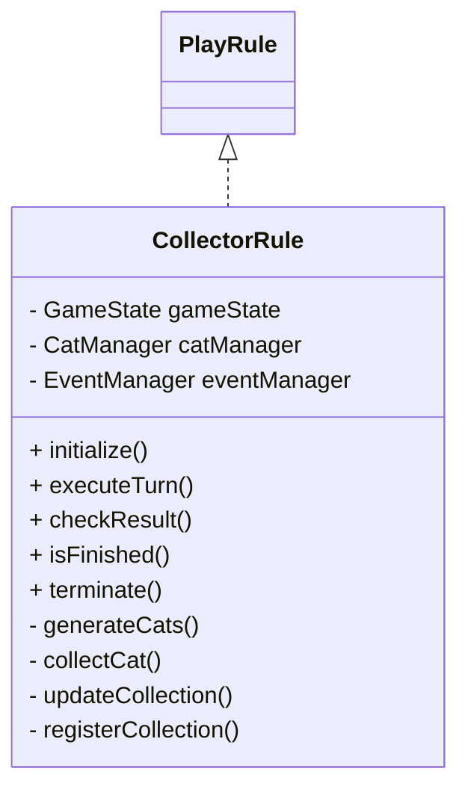
**図4-8　CollectorRuleクラス図**

## 4.8.8 依存関係図
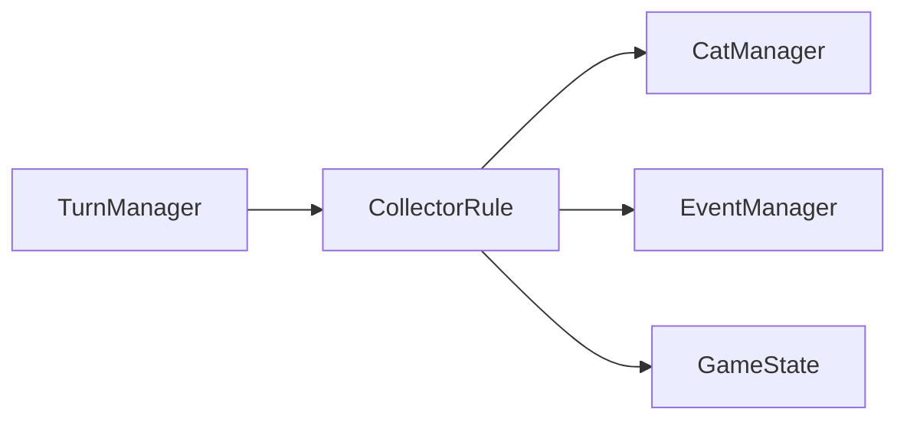
**図4-9　CollectorRule依存関係図**

## 4.8.9 利用関係

### 利用するクラス

- GameState

- CatManager

- CollectionManager

- EventManager

### 利用されるクラス

- TurnManager

- BattleMode

- AliceModifier

## 4.8.10 エラー処理

**表4-16　エラー処理**

| **事象** | **処理** |
| :-: | :-: |
| 取得情報登録失敗 | ログ出力後ゲーム継続 |
| コレクション更新失敗 | 再同期 |
| 生成失敗 | ターン継続 |

## 4.8.11 将来拡張

CollectorRuleはVersion 2.0以降の研究所機能との連携を考慮し、取得履歴や観測履歴をCollectionManagerへ集約できる構造とする。

また、新しいコレクション項目が追加された場合でも、CollectorRule自体は変更せず、CollectionManagerの拡張のみで対応できることを原則とする。

将来的に、

例：

- 取得履歴
- 図鑑
- コンプリート率
- 初取得記録
- レア猫収集

などを記録することを考慮し、

CollectorRule

      ↓

CollectionManager

      ↓

CollectionData

という連携を追加することも可能とする。

> **【設計者メモ】**

> CollectorRuleは「収集ルール」を担当するクラスであり、コレクションデータそのものは保持しない。

> 図鑑・取得履歴等の永続的なコレクション情報が必要になった場合は、CollectionManagerへ委譲する。現在のゲーム中の招き猫保有数はGameState.catsを正とする。

> また、CollectorRuleはAliceModifierを適用することで「コレクター＋アリスモード」を構成できるが、CollectorRule自身は寿命管理などの追加ルールを持たない。

# 4.9 BattleMode

## 4.9.1 概要

BattleModeは、PlayRuleを利用して対戦を実現するゲームモードである。

BattleMode自身はゲームルールを保持せず、指定されたPlayRuleに従ってゲームを進行し、その結果から勝敗判定を行う。

Version 1.0では、以下のPlayRuleによる対戦をサポートする。

- ClassicRule

- CollectorRule

- ClassicRule + AliceModifier（アリスモード）

- CollectorRule + AliceModifier（コレクター＋アリスモード）

## 4.9.2 責務

BattleModeは以下の責務を持つ。

- 対戦初期化

- PlayRule選択

- プレイヤー入力受付

- 対戦進行管理

- 勝敗判定

- 対戦終了処理

## 4.9.3 保持データ

**表4-17　保持データ一覧**

| **項目** | **概要** |
| :-: | :-: |
| gameState | ゲーム状態 |
| playRule | 現在のPlayRule |
| player1 | プレイヤー1 |
| player2 | プレイヤー2 |
| battleResult | 勝敗情報 |

## 4.9.4 公開メソッド

**表4-18　公開メソッド一覧**

| **メソッド** | **戻り値** | **概要** |
| :-: | :-: | :-: |
| initialize() | void | 対戦初期化 |
| selectRule() | void | PlayRule設定 |
| executeBattle() | void | 対戦実行 |
| judgeWinner() | void | 勝敗判定 |
| terminate() | void | 終了処理 |

## 4.9.5 内部メソッド

**表4-19　内部メソッド一覧**

| **メソッド** | **戻り値** | **概要** |
| :-: | :-: | :-: |
| executePlayerTurn() | void | プレイヤーターン実行 |
| updateBattleState() | void | 対戦状態更新 |
| checkBattleEnd() | boolean | 終了判定 |

## 4.9.6 処理概要

BattleModeは以下の順序で処理を行う。

1. 対戦初期化

2. PlayRule選択

3. プレイヤーターン実行

4. PlayRuleによるゲーム進行

5. 勝敗判定

6. 結果反映

7. 対戦終了

BattleModeはゲームルールを実装せず、PlayRuleへ処理を委譲する。
ClassicRuleでは
    • ドロップアウト通知
    • NPC通知
    • 勝敗判定
のみ実装する。
ドロップアウト本体は**4.10**を参照する。

## 4.9.7 クラス図
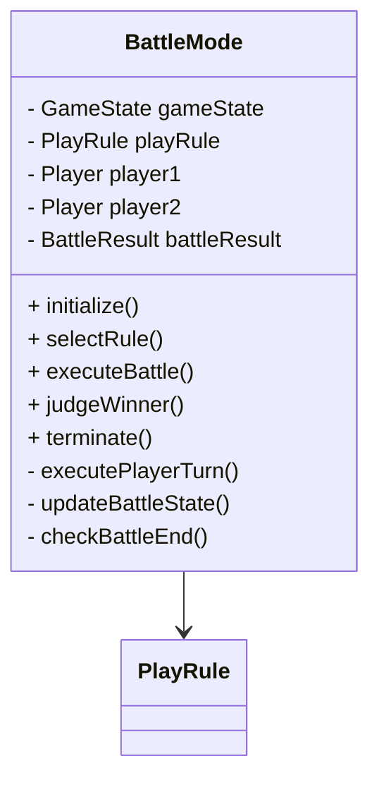
**図4-10　BattleModeクラス図**

## 4.9.8 依存関係図
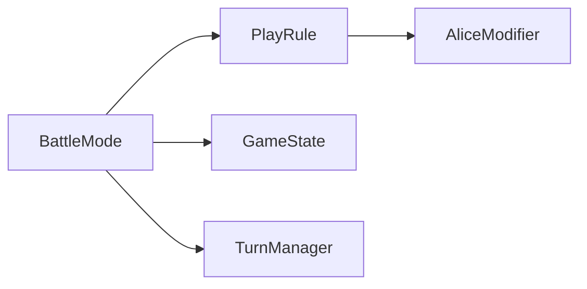
**図4-11　BattleMode依存関係図**

## 4.9.9 利用関係

### 利用するクラス

- PlayRule

- TurnManager

- GameState

### 利用されるクラス

- Main

## 4.9.10 エラー処理

**表4-20　エラー処理**

| **事象** | **処理** |
| :-: | :-: |
| PlayRule未選択 | 対戦開始不可 |
| 勝敗判定失敗 | 再判定 |
| 対戦中断 | タイトル画面へ復帰 |

## 4.9.11 将来拡張

BattleModeは、新しいPlayRuleが追加された場合でも変更せず利用できる構造とする。

Version 2.0以降では、新しいPlayRuleやRuleModifierの追加に伴い、選択可能な対戦ルールを拡張する。

> **【設計者メモ】**

> BattleModeは「ゲームルール」ではなく、「対戦を進行するシステム」である。

> 実際のゲーム処理はPlayRuleへ委譲し、BattleModeは対戦の進行管理と勝敗判定のみを担当する。

> この構成により、新しいPlayRuleやRuleModifierが追加されても、BattleModeは既存の仕組みをそのまま利用できる。

 #  4.10 ドロップアウト実装
 ##  4.10.1 概要
本節では、ドロップアウト処理の実装方法を定義する。
本節は、以下に共通して適用する。
   - ClassicRule
   - CollectorRule
   - ClassicRule + AliceModifier（アリスモード）
   - CollectorRule + AliceModifier（コレクター＋アリスモード）
   - BattleMode
## 4.10.2 責務
ドロップアウト処理は、PlayRuleの責務とする。
本処理では、以下を管理する。
- ドロップアウト可能判定
- 招き猫数確定
- プレイヤー状態更新
- 勝負師アリス処理
UI表示は責務に含めない。
## 4.10.3 処理フロー
プレイヤー入力

    ↓

canDropout()

    |

    ー false

    |   |

    ↓    ー 終了

executeDropout()

    ↓

招き猫数確定

    ↓

GameState更新

    ↓

勝負師アリス判定

    ↓

ゲーム進行へ復帰

**図4-12　ドロップアウト処理フロー**
## 4.10.4 canDropout()
**目的**
現在ドロップアウト可能か判定する。
**判定内容**
ゲームモードごとの条件を確認する。
ゲーム終了後はfalseを返す。
## 4.10.5 executeDropout()
**目的**
プレイヤーのドロップアウトを実行する。
**処理**
    1. 招き猫数を確定する
    2. プレイヤー状態を更新する。
    3. GameStateへ反映する。
    4. 必要に応じ、勝負師アリス処理へ移行する。
## 4.10.6 勝負師アリス
勝負師アリスの発生条件は、システム仕様書にしたがう。

本処理では、勝負師アリス判定のみ実装する。

演出は対象外とする。
## 4.10.7 BattleModeとの関係
BattleModeでは、ドロップアウト済プレイヤーを以後行動対象から除外する。

勝敗判定は、確定した招き猫数を使用する。

```
BattleMode
    ↓
「プレイヤーがドロップアウトを選択した」
    ↓
PlayRule.canDropout()
    ↓
PlayRule.executeDropout()
    ↓
GameState更新
    ↓
BattleModeへ復帰
```
つまり、
```
BattleMode：プレイヤーターンと対戦全体を管理
PlayRule：そのルールにおけるドロップアウト処理を実行
GameState：結果を保持
```
という3層分離とする。

## 4.10.8 セーブ・ロード
ドロップアウト済状態は、SaveDataへ保存する。

ロード後は完全に復元する。
## 4.10.9 将来拡張
将来Versionでは、以下のように拡張可能とする。
- ドロップアウト保険
- 強制ドロップアウト
- 特殊イベント
- NPC特殊能力

# 第5章　データモデル・AI設計

## 5.1 目的

本章では、「招き猫ゲーム」を構成するデータモデルおよびAIの実装方法を定義する。

ゲーム全体で利用するデータ構造を整理し、実行時オブジェクトと永続化データを明確に分離することで、保守性および拡張性の高い構造を実現する。

また、NPCの思考処理についても本章で定義する。

## 5.2 データモデル構成

データモデルは次の構成とする。

```mermaid
%% 図5-1 データモデル構成

flowchart TD

    GameState

    GameState --> PlayerData
    GameState --> CollectionData
    GameState --> SaveData

    PlayerData --> Player

    Player --> HumanPlayer
    Player --> NpcPlayer

    NpcPlayer --> NpcAI

    NpcAI --> EasyStrategy
    NpcAI --> NormalStrategy
    NpcAI --> HardStrategy
```
**図5-1　データモデル構成**

# 5.3 Player

## 5.3.1 概要

Playerは、ゲームプレイ中のプレイヤーを表す実行時オブジェクトである。

入力受付、現在の状態、ターン進行など、ゲーム中のみ必要となる情報を保持する。

セーブ対象となるデータは保持せず、永続化が必要な情報はPlayerDataで管理する。

## 5.3.2 責務

Playerは以下の責務を持つ。

- プレイヤー入力受付

- 現在状態管理

- PlayRuleとの連携

- ターン進行

- 行動要求

## 5.3.3 保持データ

**表5-1　保持データ一覧**

| **項目** | **概要** |
| :-: | :-: |
| playerId | プレイヤーID |
| playerName | 表示名 |
| currentState | 現在状態 |
| playRule | 現在適用中のPlayRule |

## 5.3.4 公開メソッド

**表5-2　公開メソッド一覧**

| **メソッド** | **戻り値** | **概要** |
| :-: | :-: | :-: |
| initialize() | void | 初期化 |
| update() | void | 状態更新 |
| getAction() | Action | 行動取得 |
| reset() | void | 状態初期化 |

## 5.3.5 クラス図
```mermaid
%% 図5-2　Playerクラス図

classDiagram

class Player{

- int playerId

- String playerName

- PlayerState currentState

- PlayRule playRule

+ initialize()

+ update()

+ getAction()

+ reset()

}
```
**図5-2　Playerクラス図**

## 5.3.6 設計方針

Playerは実行中のみ存在するオブジェクトとし、セーブ対象としない。

プレイヤーの実績やコレクションなどはPlayerDataへ委譲する。

> **【設計者メモ】**

> Playerは「ゲームを遊んでいる現在のプレイヤー」を表現するクラスである。

> 永続化が必要な情報を保持しないことで、ゲーム終了時には破棄できる軽量なオブジェクトとする。

# 5.4 PlayerData

## 5.4.1 概要

PlayerDataは、プレイヤーの永続化データを保持するクラスである。

ゲーム終了後も保持する必要がある情報を管理し、SaveManagerによって保存・読込を行う。

## 5.4.2 責務

PlayerDataは以下の責務を持つ。

- プレイヤープロフィール保持

- 実績保持

- コレクション保持

- プレイ統計保持

- 保存対象データ管理

## 5.4.3 保持データ

**表5-3　保持データ一覧**

| **項目** | **概要** |
| :-: | :-: |
| playerName | プレイヤー名 |
| collectionData | コレクション情報 |
| statistics | 統計情報 |
| achievementData | 実績情報 |

## 5.4.4 公開メソッド

**表5-4　公開メソッド一覧**

| **メソッド** | **戻り値** | **概要** |
| :-: | :-: | :-: |
| getProfile() | Profile | プロフィール取得 |
| updateStatistics() | void | 統計更新 |
| updateCollection() | void | コレクション更新 |
| resetData() | void | 初期化 |

## 5.4.5 クラス図
```mermaid
%% 図5-3　PlayerDataクラス図

classDiagram

class PlayerData{

- String playerName

- CollectionData collectionData

- Statistics statistics

- AchievementData achievementData

+ getProfile()

+ updateStatistics()

+ updateCollection()

+ resetData()

}
```
**図5-3　PlayerDataクラス図**

## 5.4.6 利用関係

### 利用するクラス

- CollectionData

- Statistics

- AchievementData

### 利用されるクラス

- SaveManager

- Player

- ResearchMode（将来）

> **【設計者メモ】**

> PlayerDataは、プレイヤーの「記録」を管理するクラスである。

> Playerがゲーム中の状態を表すのに対し、PlayerDataはゲーム終了後も保持される資産を表す。

> この役割分担により、ゲームプレイとセーブデータの責務を明確に分離できる。

# 5.5 HumanPlayer

## 5.5.1 概要

HumanPlayerは、人間が操作するプレイヤーを表す実装クラスである。

入力デバイス（キーボード、マウス、タッチ操作等）からの入力を取得し、PlayRuleへ行動要求を渡す。

## 5.5.2 責務

HumanPlayerは以下の責務を持つ。

- 入力受付

- 入力検証

- 行動決定

- PlayRuleへの通知

## 5.5.3 保持データ

**表5-5　保持データ一覧**

| **項目** | **概要** |
| :-: | :-: |
| inputManager | 入力管理 |
| currentAction | 現在の行動 |

## 5.5.4 公開メソッド

**表5-6　公開メソッド覧**

| **メソッド** | **戻り値** | **概要** |
| :-: | :-: | :-: |
| initialize() | void | 初期化 |
| getAction() | Action | 入力取得 |
| update() | void | 状態更新 |

## 5.5.5 クラス図
```mermaid
%% 図5-4 HumanPlayerクラス図

classDiagram

Player <|-- HumanPlayer

class HumanPlayer{

    - InputManager inputManager

    - Action currentAction

    + initialize()

    + getAction()

    + update()

}
```
**図5-4　HumanPlayerクラス図**

## 5.5.6 利用関係

### 利用するクラス

- InputManager

### 利用されるクラス

- BattleMode

- PlayRule

> **【設計者メモ】**

> HumanPlayerは入力装置を意識する唯一のクラスとする。

> PlayRuleは入力方法を知らず、Actionのみを受け取る。

# 5.6 NpcPlayer

## 5.6.1 概要

NpcPlayerはCPUが操作するプレイヤーを表す実装クラスである。

行動決定そのものはNpcAIへ委譲し、NpcPlayerはAIが返したActionをPlayRuleへ渡す役割のみを担当する。

## 5.6.2 責務

NpcPlayerは以下の責務を持つ。

- AI呼び出し

- 行動取得

- 状態更新

- PlayRuleとの連携

## 5.6.3 保持データ

**表5-7　保持データ一覧**

| **項目** | **概要** |
| :-: | :-: |
| npcAI | AI |
| difficulty | 難易度 |

## 5.6.4 公開メソッド

**表5-8　公開メソッド一覧**

| **メソッド** | **戻り値** | **概要** |
| :-: | :-: | :-: |
| initialize() | void | 初期化 |
| getAction() | Action | AI行動取得 |
| update() | void | 状態更新 |

## 5.6.5 クラス図
```mermaid
%% 図5-5 NpcPlayerクラス図

classDiagram

Player <|-- NpcPlayer

NpcPlayer --> NpcAI

class NpcPlayer{

    - NpcAI npcAI

    - Difficulty difficulty

    + initialize()

    + getAction()

    + update()

}
```
**図5-5　NpcPlayerクラス図**

## 5.6.6 利用関係

### 利用するクラス

- NpcAI

### 利用されるクラス

- BattleMode

- PlayRule

> **【設計者メモ】**

> NpcPlayer自身は思考処理を持たない。

> AIの交換のみで難易度を変更できる構造とする。

# 5.7 NpcAI

## 5.7.1 概要

NpcAIはNPCの思考処理を提供する共通クラスである。

ゲーム状態を取得し、Strategyへ評価を委譲し、最終的な行動を決定する。

本クラスは詳細設計書「図7-3 NPC行動決定フロー」の実装に対応する。

## 5.7.2 責務

NpcAIは以下の責務を持つ。

- ゲーム状態取得

- プレイヤー情報取得

- DecisionStrategy呼び出し

- Action生成

ゲーム状態の評価はDecisionStrategyへ委譲する。
NPCは、**4.10**で定義するドロップアウト仕様を利用してドロップアウト判断を行う。

## 5.7.3 クラス図
```mermaid
%% 図5-6 NPC AI構成

classDiagram

NpcPlayer --> NpcAI

NpcAI --> DecisionStrategy

DecisionStrategy <|-- EasyStrategy
DecisionStrategy <|-- NormalStrategy
DecisionStrategy <|-- HardStrategy

class NpcAI{

    - DecisionStrategy strategy

    + decideAction()

}

class DecisionStrategy{

<<interface>>

+ decide()

}
```
**図5-6　NPC AI構成**

## 5.7.4 処理概要
```mermaid
%% 図5-7 NPC思考処理フロー

flowchart TD

    A["ゲーム状態取得"]

    B["情報評価"]

    C["DecisionStrategy"]

    D["行動決定"]

    E["Action生成"]

    A --> B

    B --> C

    C --> D

    D --> E
```
**図5-7　NPC思考処理フロー**

**判断材料**
    • 招き猫数
    • 残ターン
    • イベント期待値
    • 勝負師アリス期待値
    • 相手状態

> **【設計者メモ】**

> NpcAIは思考アルゴリズムを持たない。

ゲーム状態を取得し、DecisionStrategyへ渡し、返却されたActionをPlayRuleへ通知する役割のみを担当する。

AIの強さや思考方法はDecisionStrategyによって決定される。

# 5.8 DecisionStrategy

## 5.8.1 概要

DecisionStrategyは、NPCの思考アルゴリズムを定義する共通インターフェースである。

ゲーム状態を評価し、現在の状況に応じた最適なActionを決定する。

難易度ごとの差異は、本インターフェースを実装する各Strategyクラスによって実現する。

各Strategyは、**4.10**で定義するドロップアウト仕様を利用して意思決定を行う。

## 5.8.2 責務

DecisionStrategyは以下の責務を持つ。

- 自分の状況評価

- 対戦相手の状況評価

- ゲーム盤面評価

- 将来予測評価

- 行動候補生成

- Action返却

## 5.8.3 公開メソッド

**表5-9　公開メソッド一覧**

| **メソッド** | **戻り値** | **概要** |
| :-: | :-: | :-: |
| decide() | Action | 行動決定 |
| shouldDropout() | Boolean | ドロップアウト判断 |

shouldDropout() は、現在のゲーム状態からNPCがドロップアウトを選択すべきかを判断する。実際のドロップアウト処理はPlayRuleが担当する。

## 5.8.4 クラス図
```mermaid
%% 図5-8 DecisionStrategyクラス図

classDiagram

class DecisionStrategy{

<<interface>>

+ decide(GameState): Action

}

DecisionStrategy <|.. EasyStrategy
DecisionStrategy <|.. NormalStrategy
DecisionStrategy <|.. HardStrategy
```
**図5-8　DecisionStrategyクラス図**

## 5.8.5 設計方針

DecisionStrategyは、ゲーム状態を多面的に評価してActionを決定する。

評価対象は以下を基本とする。

- 自分の状況

- 対戦相手の状況

- ゲーム盤面

- 将来予測

各Strategyはこれらの評価項目に対する重み付けや評価方法を変更することで難易度を実現する。

> **【設計者メモ】**

> DecisionStrategyは「思考アルゴリズム」のみを担当する。

> ゲーム進行や入力管理などの責務を持たせないことで、AIの交換や追加を容易にする。

# 5.9 EasyStrategy

## 5.9.1 概要

EasyStrategyは初級難易度用AIである。

ゲーム状態の一部のみを参照し、比較的単純な評価によって行動を決定する。

適度なランダム性を持たせることで、人間が勝ちやすいAIを実現する。

## 5.9.2 特徴

- 評価項目が少ない

- ランダム性が高い

- 最善手を必ず選択しない

# 5.10 NormalStrategy

## 5.10.1 概要

NormalStrategyは標準難易度用AIである。

ゲーム状態を総合的に評価し、基本的には最も有利な行動を選択する。

ただし、一部ランダム要素を残すことで、人間らしい判断を行う。

## 5.10.2 特徴

- 全体評価

- バランス重視

- 適度なランダム性

# 5.11 HardStrategy

## 5.11.1 概要

HardStrategyは上級難易度用AIである。

ゲーム状態を詳細に評価し、期待値が最大となるActionを選択する。

ランダム要素は極めて小さく、常に最適手に近い行動を選択する。

## 5.11.2 特徴

- 詳細評価

- 期待値最大化

- ランダム性最小

**難易度比較**
```mermaid
%% 図5-9 AI難易度比較

flowchart LR

    Easy["Easy<br/>高ランダム性"]

    Normal["Normal<br/>バランス型"]

    Hard["Hard<br/>期待値重視"]

    Easy --> Normal

    Normal --> Hard
```
**図5-9　AI難易度比較**

**DecisionStrategy利用フロー**
```mermaid
%% 図5-10 Strategy適用フロー

flowchart TD

    A["NpcPlayer"]

    B["NpcAI"]

    C["DecisionStrategy"]

    D["Easy / Normal / Hard"]

    E["Action"]

    A --> B

    B --> C

    C --> D

    D --> E
```
**図5-10　Strategy適用フロー**

> **【設計者メモ】**

> Easy・Normal・Hardは「別AI」ではなく、「同一AIの思考アルゴリズムの違い」として設計する。

> これにより、ゲーム状態取得やAction生成などの共通処理をNpcAIへ集約し、保守性を向上させる。

**DecisionStrategyの内部構造**
```mermaid
%% 図5-11 DecisionStrategy評価構成

flowchart TD

    A["DecisionStrategy"]

    B["自分の状況評価"]

    C["対戦相手評価"]

    D["盤面評価"]

    E["将来予測"]

    F["評価値算出"]

    G["Action決定"]

    A --> B
    A --> C
    A --> D
    A --> E

    B --> F
    C --> F
    D --> F
    E --> F

    F --> G
```
**図5-11　DecisionStrategy評価構成**

## 5.11.3 難易度比較

**表5-10　難易度比較覧**

| **評価項目** | **Easy** | **Normal** | **Hard** |
| :-: | :-: | :-: | :-: |
| 自分の状況 | ◎ | ◎ | ◎ |
| 対戦相手の状況 | △ | ○ | ◎ |
| ゲーム盤面 | ○ | ◎ | ◎ |
| 将来予測 | × | △ | ◎ |
| ランダム性 | 高 | 中 | 低 |

**【設計者メモ】**

本作品のNPCは単に「最強のAI」を目指すものではない。

難易度ごとに評価対象やランダム性を調整し、「対戦していて楽しい相手」を実現することを目的とする。

Version 2.0以降、新しいDecisionStrategyを追加する場合も、本評価構造を継承することを推奨する。

# 5.12 CollectionData

## 5.12.1 概要

**本データモデルは現行Versionのコレクターモードの勝利判定には使用しない。将来的な取得履歴、図鑑、コンプリート率等の機能拡張に備えて定義する。**

CollectionDataは、プレイヤーが取得した招き猫のコレクション情報を保持するデータクラスである。

取得状況、取得日時、取得回数など、コレクションに関する永続データを管理する。

本クラスはPlayerDataの一部として保持され、SaveManagerによって保存および読込を行う。

## 5.12.2 責務

CollectionDataは以下の責務を持つ。

- 招き猫取得状況管理

- コレクション情報保持

- 取得履歴保持

- コンプリート率算出

- 保存対象データ管理

## 5.12.3 保持データ

**表5-11　保持データ一覧**

| **項目** | **概要** |
| :-: | :-: |
| collectionList | 取得済み招き猫一覧 |
| completionRate | コンプリート率 |
| totalCollected | 取得総数 |
| lastCollectedDate | 最終取得日時 |

## 5.12.4 公開メソッド

**表5-12　公開メソッド一覧**

| **メソッド** | **戻り値** | **概要** |
| :-: | :-: | :-: |
| addCollection() | void | 取得登録 |
| contains() | boolean | 取得済み判定 |
| getCompletionRate() | double | 達成率取得 |
| clear() | void | 初期化 |

## 5.12.5 クラス図
```mermaid
%% 図5-12 CollectionDataクラス図

classDiagram

class CollectionData{

    - List<CatId> collectionList

    - double completionRate

    - int totalCollected

    - LocalDateTime lastCollectedDate

    + addCollection()

    + contains()

    + getCompletionRate()

    + clear()

}
```
**図5-12　CollectionDataクラス図**

## 5.12.6 利用関係

### 利用するクラス

なし

### 利用されるクラス

- PlayerData

- CollectionManager

- SaveManager

## 5.12.7 設計方針

CollectionDataは**データのみ**を保持する。

取得判定や登録処理などのゲームロジックはCollectionManagerが担当する。

> **【設計者メモ】**

> CollectionDataは「コレクション情報を保存する器」である。

> データ管理とゲームロジックを分離することで、CollectionManagerから安全に利用できる構造とする。

# 5.13 SaveData

## 5.13.1 概要

SaveDataは、セーブデータ全体を保持するデータクラスである。

GameState、PlayerDataなど保存対象となるデータを集約し、SaveManagerとの受け渡しを行う。

hasDroppedOut、fixedCatCountはドロップアウト済状態を保存する。

## 5.13.2 責務

SaveDataは以下の責務を持つ。

- 保存対象データ保持

- Version情報保持

- 保存日時保持

- データ整合性維持

## 5.13.3 保持データ

**表5-13　保持データ一覧**

| **項目** | **概要** |
| :-: | :-: |
| saveVersion | セーブデータVersion |
| playerData | プレイヤーデータ |
| gameState | ゲーム状態 |
| savedDate | 保存日時 |
| hasDroppedOut | ドロップアウト状態 |
| fixedCatCount | 修正後招き猫数 |

## 5.13.4 公開メソッド

**表5-14　公開メソッド一覧**

| **メソッド** | **戻り値** | **概要** |
| :-: | :-: | :-: |
| getVersion() | String | Version取得 |
| validate() | boolean | 整合性確認 |
| reset() | void | 初期化 |

## 5.13.5 クラス図
```mermaid
%% 図5-13 SaveDataクラス図

classDiagram

SaveData --> PlayerData
SaveData --> GameState

class SaveData{

    - String saveVersion

    - PlayerData playerData

    - GameState gameState

    - LocalDateTime savedDate

    + getVersion()

    + validate()

    + reset()

}
```
**図5-13　SaveDataクラス図**

## 5.13.6 利用関係

### 利用するクラス

- PlayerData

- GameState

### 利用されるクラス

- SaveManager

## 5.13.7 設計方針

SaveDataは保存形式（JSON等）に依存しない。

保存媒体が変更されても、本クラスの構造は変更しないことを原則とする。

> **【設計者メモ】**

> SaveDataは「セーブファイルそのもの」ではなく、「セーブ対象となるデータ集合」を表現するクラスである。

> 保存形式とデータ構造を分離することで、Versionアップ時の互換性を確保しやすくする。

# 第6章　例外処理・ログ設計

## 6.1 目的

本章では、「招き猫ゲーム」における例外処理およびログ出力方針を定義する。

例外発生時にゲーム全体が停止しないよう適切なエラー処理を行い、開発時および保守時の調査に必要な情報をログとして記録する。

# 6.2 基本方針

本システムでは、例外を表6-1に示す3種類に分類する。

**表6-1　例外分類一覧**

| **分類** | **概要** | **ゲーム継続** |
| :-: | :-: | :-: |
| Recoverable Error | 処理を継続可能なエラー | ○ |
| Warning | ゲーム進行へ影響しない警告 | ○ |
| Fatal Error | ゲーム継続が不可能なエラー | × |

# 6.3 例外処理フロー
```mermaid
%% 図6-1 例外処理フロー

flowchart TD

    A["処理開始"]

    B["例外発生"]

    C{"例外種別"}

    D["Warning"]

    E["Recoverable"]

    F["Fatal"]

    G["ログ出力"]

    H["処理継続"]

    I["復旧処理"]

    J["タイトル画面へ戻る"]

    A --> B

    B --> C

    C --> D
    C --> E
    C --> F

    D --> G
    G --> H

    E --> I
    I --> G

    F --> G
    G --> J
```
**図6-1　例外処理フロー**

# 6.4 ログレベル

ログは表6-2に示す5段階とする。

**表6-2　ログレベル一覧**

| **レベル** | **用途** |
| :-: | :-: |
| TRACE | 詳細な内部処理 |
| DEBUG | デバッグ情報 |
| INFO | 通常動作 |
| WARN | 警告 |
| ERROR | 重大エラー |

# 6.5 ログ出力対象

以下の処理ではログ出力を行う。

- ゲーム開始

- ゲーム終了

- セーブ

- ロード

- イベント発生

- NPC思考結果（DEBUG）

- 例外発生

# 6.6 ログ出力例

[INFO ] Game Start

[INFO ] ClassicRule Initialized

[DEBUG] NPC Selected Action : Collect Cat

[INFO ] Cheshire Event Triggered

[WARN ] Collection Already Exists

[ERROR] Save Failed

# 6.7 設計方針

ログは開発支援を目的とし、ゲームロジックへ影響を与えない。

ユーザーへ表示するメッセージと開発者向けログは分離する。

> **【設計者メモ】**

> Version 1.0ではログファイルへの保存は必須としない。

> 開発中はコンソール出力を基本とし、必要に応じてファイル出力へ切り替えられる構造とする。

> 将来的には、デバッグビルドではDEBUGログまで出力し、リリースビルドではINFO以上のみ出力する運用を想定する。

# 第7章　プロジェクト構成設計

## 7.1 目的

本章では、「招き猫ゲーム」のソースコード構成、パッケージ構成およびファイル配置方針を定義する。

機能ごとに責務を分離し、保守性・可読性・拡張性の高いプロジェクト構成を実現する。

# 7.2 基本方針

ソースコードは責務ごとにパッケージを分割する。

各パッケージは単一責務を原則とし、相互依存を最小限に抑える。

# 7.3 パッケージ構成
```mermaid
%% 図7-1 プロジェクト構成

flowchart TD

    src["src"]

    src --> core["core"]
    src --> rule["rule"]
    src --> battle["battle"]
    src --> player["player"]
    src --> ai["ai"]
    src --> data["data"]
    src --> ui["ui"]
    src --> util["util"]

    style src fill:#F9F9F9
```
**図7-1　プロジェクト構成**

# 7.4 ディレクトリ構成
```
src/

├── core/
│   ├── GameState
│   ├── TurnManager
│   ├── EventManager
│   ├── CatManager
│   ├── CollectionManager
│   ├── RandomManager
│   └── SaveManager
│
├── rule/
│   ├── PlayRule
│   ├── ClassicRule
│   ├── CollectorRule
│   ├── RuleModifier
│   └── AliceModifier
│
├── battle/
│   └── BattleMode
│
├── player/
│   ├── Player
│   ├── HumanPlayer
│   └── NpcPlayer
│
├── ai/
│   ├── NpcAI
│   ├── DecisionStrategy
│   ├── EasyStrategy
│   ├── NormalStrategy
│   └── HardStrategy
│
├── data/
│   ├── PlayerData
│   ├── CollectionData
│   └── SaveData
│
├── ui/
│   ├── MainMenu
│   ├── GameScreen
│   ├── BattleScreen
│   └── ResultScreen
│
└── util/
    ├── Logger
    ├── Constants
    └── Utility
```
# 7.5 パッケージ依存関係
```mermaid
%% 図7-2 パッケージ依存関係

flowchart LR

    UI["ui"]

    Rule["rule"]

    Battle["battle"]

    Player["player"]

    AI["ai"]

    Core["core"]

    Data["data"]

    Util["util"]

    UI --> Rule

    UI --> Battle

    Battle --> Rule

    Battle --> Player

    Player --> AI

    Rule --> Core

    Core --> Data

    Core --> Util

    AI --> Core
```
**図7-2　パッケージ依存関係**

# 7.6 命名規則

**表7-1　命名規則表**

| **対象** | **命名規則** | **例** |
| :-: | :-: | :-: |
| Manager | ○○Manager | TurnManager |
| Rule | ○○Rule | ClassicRule |
| Modifier | ○○Modifier | AliceModifier |
| Data | ○○Data | PlayerData |
| Strategy | ○○Strategy | HardStrategy |
| 画面 | ○○Screen | GameScreen |

# 7.7 実装順序

実装は図7-3に示す順序を推奨する。
```mermaid
%% 図7-3 推奨実装順序

flowchart LR

    Core["Core"]

    Data["Data"]

    Rule["Rule"]

    Player["Player"]

    AI["AI"]

    Battle["Battle"]

    UI["UI"]

    Data --> Core 

    Core --> Rule

    Rule --> Player

    Player --> AI

    AI --> Battle

    Battle --> UI
```
**図7-3　推奨実装順序**

# 7.8 設計方針

パッケージは循環参照を禁止する。

上位レイヤは下位レイヤへ依存できるが、下位レイヤは上位レイヤへ依存しない。

> **【設計者メモ】**

> 本構成は Version 1.0 を対象としている。

> Version 2.0では以下のパッケージ追加を予定している。

> - research/

> - archive/

> - entry/

> - challenge/

> これらは既存パッケージへ影響を与えない独立構成とする。

# 第8章　実装ガイドライン

## 8.1 目的

本章では、「招き猫ゲーム」の実装におけるコーディング規約および実装方針を定義する。

可読性、保守性、拡張性を維持し、Version 2.0以降の機能追加にも対応できるコード品質を確保することを目的とする。


# 8.2 基本方針

実装にあたっては、以下の原則を遵守する。

- 単一責務の原則（Single Responsibility Principle） 

- 責務の明確な分離 

- 共通処理の集約 

- 拡張を容易にする設計 

- 可読性を最優先とする 


# 8.3 アクセス修飾子

**表8-1　アクセス修飾子一覧**

| **対象** | **方針** |
| :-: | :-: |
| フィールド | private |
| 内部メソッド | private |
| 公開API | public |
| 定数 | private static final |

必要最小限の公開範囲とする。


# 8.4 命名規則

**表8-2　命名規則表**

| **対象** | **命名例** |
| :-: | :-: |
| クラス | ClassicRule |
| Manager | TurnManager |
| Data | PlayerData |
| Strategy | HardStrategy |
| Modifier | AliceModifier |
| 変数 | camelCase |
| 定数 | UPPER\_SNAKE\_CASE |

# 8.5 メソッド設計

実装にあたっては以下を推奨する。

- 1メソッド1責務 

- 長大なメソッドを避ける 

- ネストを浅く保つ 

- 適切にprivateメソッドへ分割する 


# 8.6 定数管理

マジックナンバーは使用しない。

ゲーム内定数はConstantsクラスへ集約する。

例

```
public static final int MAX\_CAT\_COUNT = 100;
```


# 8.7 ログ出力

ログ出力はLoggerクラスを経由する。

直接System.out.println()を使用しない。

ログレベルは第6章に従う。


# 8.8 コメント記述

コメントは

**「何をしているか」**

ではなく

**「なぜその処理が必要か」**

を書く。

例

```
// NG

// 猫を削除する


// OK

// 寿命切れの猫は次ターン以降ゲームへ影響しないため削除する
```


# 8.9 nullの取り扱い

可能な限りnullを返却しない。

空コレクションまたはOptional等の利用を優先する。


# 8.10 Version管理

Version番号はSemantic Versioningを基本とする。

```
Version 1.0.0


Version 1.1.0


Version 2.0.0
```


# 8.11 テスト方針

各クラスは単体テスト可能な構造とする。

共通基盤、PlayRule、AIについては独立してテストできることを目標とする。


# 8.12 将来拡張

Version 2.0以降では以下を追加予定とする。

- Alice Research Archive 

- Alice Research Entry 

- ケーキチャレンジ 

- ドーナツチャレンジ 

- 時計盤チャレンジ 

- 色玉チャレンジ 

- ResearchMode 

- 新しいDecisionStrategy 


> **【設計者メモ】**

> 本実装設計書はVersion 1.0を対象とする。

> Version 2.0以降では、新しいゲームモードやチャレンジを追加する予定であるが、既存クラスを大幅に変更することなく拡張できることを設計方針とする。

> そのため、本設計書では責務分離、インターフェース設計、StrategyパターンおよびModifier構造を積極的に採用している。

# 付録A　クラス一覧

## A.1 目的

本付録では、「招き猫ゲーム」で使用する主要クラスの責務を一覧として整理する。

実装時および保守時に各クラスの役割を迅速に把握できるようにすることを目的とする。

## A.2 共通基盤クラス

**表A-1　共通基盤クラス一覧**

| **クラス名** | **主な責務** |
| :-: | :-: |
| GameState | ゲーム全体の状態管理 |
| TurnManager | ターン進行管理 |
| EventManager | イベント管理 |
| CatManager | 招き猫管理 |
| RandomManager | 乱数・確率判定 |
| SaveManager | セーブ・ロード管理 |

## A.3 データモデル

**表A-2　データモデル一覧**

| **クラス名** | **主な責務** |
| :-: | :-: |
| Player | プレイヤー情報 |
| HumanPlayer | プレイヤー操作 |
| NpcPlayer | NPCプレイヤー |
| Cat | 招き猫情報 |
| Score | スコア管理 |
| Statistics | 統計情報 |
| PlayerData | プレイヤーデータ保持 |
| CollectionData | コレクション情報保持 |
| SaveData | セーブデータ保持 |

## A.4 AI関連クラス

**表A-3　AIクラス一覧**

| **クラス名** | **主な責務** |
| :-: | :-: |
| NpcAI | NPC思考制御 |
| DecisionStrategy | 思考アルゴリズム共通インターフェース |
| EasyStrategy | 初級AI |
| NormalStrategy | 標準AI |
| HardStrategy | 上級AI |

## A.5 ゲームモード

**表A-4　ゲームモード一覧**

| **クラス名** | **主な責務** |
| :-: | :-: |
| ClassicMode | クラシックモード |
| CollectorMode | コレクターモード |
| AliceModifier | アリスルールの適用 |
| BattleMode | バトルモード |

> **【設計者メモ】**
>
> 本付録はクラス責務の索引である。
> 詳細な実装内容については、各章を正本とする。

# 付録B　命名規則

## B.1 目的

本付録では、本プロジェクトにおける命名規則を定義する。

命名規則を統一することにより、可読性、保守性及び再利用性の向上を図る。

## B.2 クラス名

クラス名は PascalCase を使用する。

**表B-1　クラス名命名例**

| **対象** | **例** |
| :-: | :-: |
| ゲーム状態 | GameState |
| ターン管理 | TurnManager |
| 招き猫 | Cat |

## B.3 メソッド名

メソッド名は camelCase を使用する。

**表B-2　メソッド命名例**

| **対象** | **例** |
| :-: | :-: |
| 初期化 | initialize() |
| ターン開始 | startTurn() |
| ターン終了 | endTurn() |
| セーブ | saveGame() |

動詞から始まる名称とし、処理内容が推測できる名称を使用する。

## B.4 変数名

変数名は camelCase を使用する。

**表B-3　変数命名例**

| **対象** | **例** |
| :-: | :-: |
| 現在ターン | currentTurn |
| 招き猫一覧 | catList |
| ゲームモード | gameMode |

略語は必要最小限とする。

## B.5 定数

定数は UPPER_SNAKE_CASE を使用する。

**表B-4　定数命名例**

| **対象** | **例** |
| :-: | :-: |
| 最大ターン数 | MAX_TURN |
| 初期寿命 | DEFAULT_LIFETIME |
| 最大所持数 | MAX_CAT_COUNT |

## B.6 ファイル名

ファイル名はクラス名と一致させることを原則とする。

例

- GameState.js
- TurnManager.js
- CatManager.js

> **【設計者メモ】**
>
> 命名規則は可読性を高めるための共通ルールである。
> 一貫性を維持することを優先し、既存規則との整合性を保つことを原則とする。

# 付録C　用語集

## C.1 目的

本付録では、本書で使用する主要な用語を定義する。

本用語集は、システム仕様書及び詳細設計書との用語統一を目的とする。

## C.2 用語一覧

**表C-1　用語一覧**

| **用語** | **意味** |
| :-: | :-: |
| GameState | ゲーム全体の状態を保持する共通基盤クラス |
| Turn | ゲーム進行の基本単位 |
| Event | ゲーム本編から独立して実行される処理 |
| Challenge | 独立したゲームイベント |
| GameMode | ゲームルールを定義する実行単位 |
| Cat | 招き猫を表すゲームオブジェクト |
| Player | プレイヤー情報 |
| NPC | コンピュータ制御プレイヤー |
| AI | NPCの思考アルゴリズム |
| SaveData | 保存対象となるゲームデータ |

## C.3 文書間の位置付け

本付録で定義する用語は、システム仕様書及び詳細設計書で使用する用語と共通である。

用語の定義が変更された場合は、関連文書についても併せて更新するものとする。

> **【設計者メモ】**
>
> 用語は仕様書・詳細設計書・実装設計書で統一して使用する。
> 同一概念に対して複数の名称を使用しないことを原則とする。